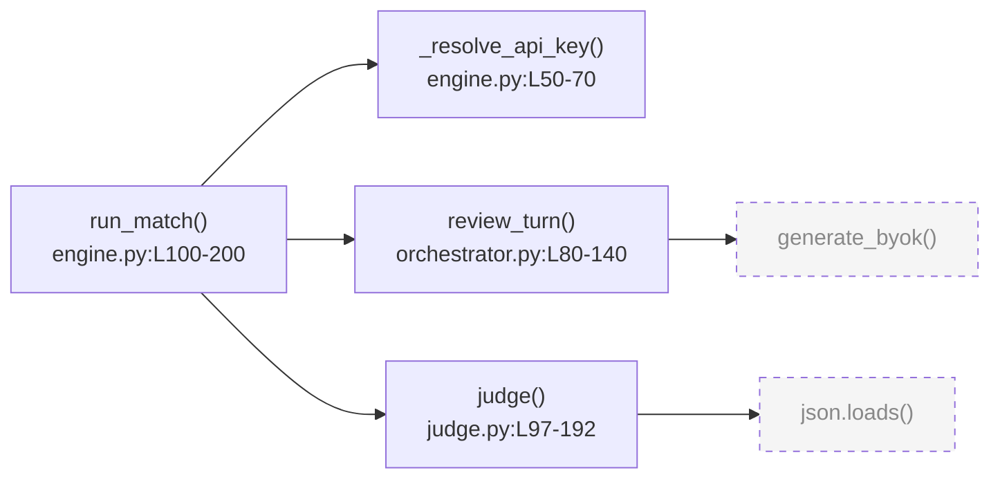

<Purpose>
Code Walkthrough는 기존 코드베이스의 특정 진입 함수(또는 파일)에서 시작하여 호출 흐름을 자동으로 추적하고, Mermaid 다이어그램으로 전체 흐름을 시각화한 뒤, 함수 하나씩 AI가 설명하고 사용자가 질문할 수 있는 인터랙티브 코드 워크스루 스킬이다.

**코드 수정이 목적이 아니다.** 코드베이스를 처음 접하거나 특정 흐름을 이해하고 싶은 개발자가 능동적으로 이해하는 것이 목적이다.

핵심 메커니즘:
1. 진입 함수(또는 파일)를 파악한다 — 사용자가 직접 지정하거나 AI가 후보를 제안한다.
2. Glob/Grep/Read로 프로젝트 내부 콜 그래프를 추적한다 (외부 라이브러리는 스탑).
3. 전체 흐름을 시각화한다 — tldraw 캔버스(우선) → Figma MCP → Mermaid 코드블록(폴백) 순으로 시도한다.
4. tldraw 사용 시: 워크스루 진행 중 현재 설명 함수 노드를 강조(노란색)하여 시각적 지도로 활용한다.
5. 함수마다 AI 설명 → 사용자 Q&A 허용 → "다음" 선택 시 진행 (하드 블락).
6. 흐름 종단 도달 시 자동 종료 또는 사용자 "중단/저장" 선택으로 종료한다.
7. 워크스루 결과를 `.omc/walkthroughs/` 아래에 Mermaid 파일과 이해 요약 문서로 저장한다.
</Purpose>

<Use_When>
- 코드베이스를 처음 접하고 어디서 무엇이 어떻게 동작하는지 이해하고 싶을 때
- "walkthrough", "코드 흐름 설명", "이 함수부터 따라가줘", "콜 그래프 보여줘" 같은 요청이 들어올 때
- 특정 기능의 실행 경로를 시각적으로 파악하고 싶을 때
- 코드 리뷰나 리팩토링 전에 흐름을 먼저 이해해두고 싶을 때
- 팀 내 지식 공유나 온보딩 문서로 워크스루 결과를 저장하고 싶을 때

**기존 스킬들과의 차별점:**
- **code-audit-interview**: Claude가 이슈를 발견하고 수정까지 진행 → 코드를 *고치는* 것이 목적
- **refactor-interview**: 사용자가 리팩토링 방향을 알고 시작 → 변경 사항을 *납득하고 실행*하는 것이 목적
- **code-walkthrough**: 코드를 *전혀 수정하지 않음* → 흐름을 *이해*하는 것이 유일한 목적
</Use_When>

<Do_Not_Use_When>
- 코드의 문제점을 찾고 수정하고 싶을 때 -- code-audit-interview를 사용하세요
- 특정 리팩토링 계획을 실행하고 싶을 때 -- refactor-interview를 사용하세요
- 코드 이해 없이 바로 구현이나 수정이 목적일 때 -- executor 또는 ralph를 사용하세요
- 무한 재귀 함수처럼 콜 그래프 추적이 불가능한 경우 (순환 탐지 후 경고로 대체)
</Do_Not_Use_When>

<Why_This_Exists>
AI 코드 어시스턴트는 코드를 수정하거나 이슈를 찾는 데 특화되어 있다. 하지만 개발자가 가장 먼저 필요한 것은 "이 코드가 어떻게 동작하는가"를 이해하는 것이다. 기존 스킬들은 이해보다 수정에 초점이 맞춰져 있어, 코드 흐름을 따라가면서 하나씩 물어볼 수 있는 인터랙티브한 경험이 없었다.

Code Walkthrough는 이 문제를 구조적으로 해결한다:
- Glob/Grep/Read로 실제 코드를 스캔하여 콜 그래프를 추적한다 (추측 금지).
- Mermaid 다이어그램으로 전체 흐름을 한눈에 보여준다.
- 함수 하나하나를 AI가 설명하고, 사용자가 이해할 때까지 Q&A를 허용한다.
- "다음" 없이 진행 불가 원칙으로 빠른 훑기를 방지한다.
- 워크스루 결과를 `.omc/walkthroughs/`에 저장하여 팀 지식 공유 문서로 활용할 수 있다.
</Why_This_Exists>

<Execution_Policy>
- 코드를 수정하지 않는다 — Read/Glob/Grep/Write(출력 저장)만 사용, Edit/Bash(코드 변경) 금지
- 콜 그래프는 반드시 Glob/Grep/Read로 실제 코드를 스캔하여 추적한다 (추측 금지)
- 외부 라이브러리(SQLAlchemy, httpx, redis 등) 함수 호출은 탐색 중단 + Mermaid 점선 노드로 표시
- 순환 참조(A→B→A) 감지 시 경고 표시 후 더 이상 재귀하지 않는다
- 한 번에 하나의 함수만 설명한다 — 여러 함수를 동시에 설명하지 않는다
- "다음" 선택 전까지 다음 함수로 절대 진행하지 않는다 (하드 블락)
- "건너뛰기" 선택지는 절대 제공하지 않는다
- 인터뷰 상태를 `state_write`로 저장하여 세션 중단/재개를 지원한다
</Execution_Policy>

<Steps>

## Phase 1: 진입점 파악

**목적:** 워크스루 시작점이 되는 파일/함수를 결정하고, 콜 그래프 초기 추적을 시작한다.

### Step 1-1: 입력 파싱 및 세션 확인

1. `{{ARGUMENTS}}`를 파싱한다:
   - `<파일경로>:<함수명>` → 지정된 함수에서 시작
   - `<파일경로>` → 파일의 주요 진입 함수를 AI가 탐지
   - `--boundary <경계경로>` → 탐색 경계 지정 (기본: 프로젝트 전체 내부)
   - 인수 없음 → Step 1-2로 이동 (AI 자동 탐지)

2. `state_read`로 기존 세션을 확인한다:
   - 진행 중인 세션이 있으면 `AskUserQuestion`으로 재개 여부를 묻는다:
     - "이전 워크스루 세션을 이어서 진행할까요?" → 마지막 진행 노드부터 재개
     - "새로 시작할까요?" → 기존 상태 초기화

### Step 1-2: 진입 함수 탐지 (인수 없을 때)

AI가 Glob/Grep으로 코드베이스를 스캔하여 주요 진입 함수 후보를 제안한다:

- `main.py`, `app.py`, `server.py` 같은 메인 파일 탐색
- API 라우터 함수, 이벤트 핸들러, 스케줄러 진입점 탐지
- 파일 크기, 호출 빈도(피호출 횟수가 적고 호출 횟수가 많은 함수)로 후보 선정

```
주요 진입 함수 후보:
[1] backend/app/main.py — create_app() (FastAPI 앱 초기화)
[2] backend/app/services/debate/engine.py — run_match() (토론 엔진 진입점)
[3] backend/app/services/debate/matching_service.py — ready_up() (매칭 완료 처리)
[4] backend/app/api/debate_matches.py — stream_match() (SSE 스트리밍 엔드포인트)
[5] 직접 입력...
```

`AskUserQuestion`으로 진입 함수를 선택받는다.

### Step 1-3: 콜 그래프 초기 추적 (1~2레벨)

Glob/Grep/Read로 진입 함수에서 시작하는 콜 그래프를 추적한다:

**탐색 범위 기준:**
- 프로젝트 내부 함수: 탐색 계속 (import된 로컬 모듈의 함수)
- 외부 라이브러리: 탐색 중단 (SQLAlchemy, httpx, redis, fastapi, openai 등)
- `--boundary` 지정 시: 해당 경로 내 함수까지만 탐색

**순환 참조 감지:**
- 방문한 함수 목록을 추적하여 이미 방문한 함수 재방문 시 순환으로 처리
- `visited_nodes` 집합에 추가 전 존재 여부 확인

**탐색 예시:**
```
run_match()
  ├─ _resolve_api_key()       [내부 — 탐색]
  ├─ LLM 호출()               [외부: InferenceClient — 스탑]
  ├─ review_turn()            [내부 — 탐색]
  │   └─ generate_byok()      [외부: InferenceClient — 스탑]
  └─ judge()                  [내부 — 탐색]
      └─ json.loads()         [외부: stdlib — 스탑]
```

### Step 1-4: 초기 상태 저장

`state_write`로 워크스루 세션을 저장한다:

```json
{
  "active": true,
  "current_phase": "code-walkthrough",
  "state": {
    "session_id": "<uuid>",
    "entry_point": {"file": "engine.py", "function": "run_match"},
    "boundary": null,
    "call_graph": {
      "root": "run_match",
      "nodes": [
        {"name": "run_match", "file": "engine.py", "line_range": [100, 200], "status": "pending"},
        {"name": "_resolve_api_key", "file": "engine.py", "line_range": [50, 70], "status": "pending"}
      ],
      "edges": [{"from": "run_match", "to": "_resolve_api_key"}],
      "external_nodes": ["InferenceClient.generate_byok", "json.loads"],
      "cycle_nodes": []
    },
    "current_node_index": 0,
    "visited_nodes": [],
    "qa_log": [],
    "render_mode": "tldraw|figma|mermaid",
    "tldraw_node_ids": {}
  }
}
```

---

## Phase 2: 콜 그래프 시각화

**목적:** Phase 1에서 추적한 콜 그래프를 시각화한다. tldraw → Figma MCP → Mermaid 코드블록 순으로 폴백한다.

### Step 2-1: 다이어그램 규칙

| 노드 유형 | Mermaid 스타일 | 의미 |
|-----------|---------------|------|
| 내부 함수 (방문 예정) | `funcName["funcName()\nfile.py:L10-50"]` | 일반 직사각형 |
| 외부 라이브러리 | `ext["external_call()"]:::external` | 점선 노드 (탐색 중단) |
| 순환 참조 | `cycle["funcName() ⚠️ 순환"]:::cycle` | 경고 노드 |
| 현재 설명 중 | 강조 표시 | 현재 워크스루 위치 |



### Step 2-2: 다이어그램 렌더링 (폴백 체인)

다음 순서로 렌더링 도구를 시도한다. 성공한 도구를 세션 상태 `render_mode`에 저장한다.

**1순위: tldraw-desktop-skill**

tldraw-desktop-skill 도구가 사용 가능한지 확인한다 (`http://localhost:7236` 도달 가능 여부).
사용 가능하면 tldraw 캔버스에 콜 그래프를 그린다:

- **내부 함수 노드:** 흰 배경 사각형, 레이블: `"funcName()\nfile.py:L{start}"`
- **외부 스탑 노드:** 회색 배경(`#f5f5f5`) 사각형, 점선 테두리
- **엣지:** 화살표, 호출 방향
- **레이아웃:** 좌→우(LR), 계층별 x 간격 250px, 노드 y 간격 80px, 시작점 (100, 100)

```
render_mode = "tldraw"
📊 콜 그래프를 tldraw에 렌더링했습니다.
   tldraw 캔버스에서 전체 흐름을 확인하세요. 워크스루는 아래 채팅에서 계속됩니다.
```

**2순위: Figma MCP** (tldraw 불가 시)

`mcp__claude_ai_Figma__generate_diagram` 도구가 사용 가능한지 확인한다.
사용 가능하면 FigJam에 flowchart 형태로 콜 그래프를 생성한다. (정적 렌더링 — 진행 중 강조 없음)

```
render_mode = "figma"
📊 콜 그래프를 Figma에 렌더링했습니다. (노드 강조 기능 없음)
```

**3순위: Mermaid 코드블록** (tldraw·Figma 모두 불가 시)

```
render_mode = "mermaid"
📊 콜 그래프 (tldraw/Figma 미감지 — Mermaid로 표시)

[Mermaid 코드블록]

총 탐색 함수: {N}개
외부 스탑: {M}개 ({라이브러리명 목록})
순환 참조: {K}개 (있을 경우)
```

---

렌더링 완료 후 `AskUserQuestion`으로 시작 여부를 확인한다:
- "다이어그램대로 워크스루를 시작할까요?"
- "탐색 범위를 조정해주세요: {요청}"
- "특정 경로만 따라가고 싶습니다: {경로}"

---

## Phase 3: 함수별 워크스루 루프

**목적:** 콜 그래프의 각 함수를 방문 순서대로 하나씩 설명하고, 사용자가 Q&A 후 "다음"을 선택해야만 진행한다.

### Step 3-1: 현재 함수 설명

방문 순서대로 함수를 하나씩 선택하여 설명한다:

0. **tldraw 노드 강조** (`render_mode == "tldraw"` 일 때만):
   - 이전 함수 노드가 있으면 기본 색상(흰 배경)으로 복원한다.
   - 현재 함수 노드를 노란 배경(`#FFF3CD`)으로 변경한다.
   - tldraw를 사용하지 않는 경우(Figma/Mermaid 폴백) 이 단계를 스킵한다.

1. **위치 제시:**
   ```
   [3/8] 함수: review_turn() | orchestrator.py:L80-140
   ```

2. **실제 코드 읽기:** `Read` 도구로 해당 줄 범위를 읽어 표시한다 (생략 없이 전체).

3. **AI 설명 구조** (4가지 관점):
   - **역할:** 이 함수가 시스템에서 담당하는 책임
   - **입력/출력:** 파라미터와 반환값의 의미
   - **핵심 로직:** 함수 내부의 주요 처리 흐름
   - **호출 컨텍스트:** 어디서 호출되고 결과가 어떻게 사용되는지

4. **현재 위치 표시기:**
   ```
   진행: [✓] run_match [✓] _resolve_api_key [▶] review_turn [ ] judge [ ] ...
   ```

### Step 3-2: 하드 블락 Q&A

`AskUserQuestion`으로 사용자 응답을 받는다.

**선택지 (고정, "건너뛰기" 절대 없음):**

1. **"다음 함수로 진행해주세요."**
2. **"질문: {구체적 질문}"**
3. **"이 함수의 호출처를 더 보여주세요."**
4. **"관련 함수 [{함수명}]을 먼저 설명해주세요."**
5. **"중단하고 지금까지 결과를 저장해주세요."**

### Step 3-3: Q&A 라운드 제한

- **10 라운드 도달 시:** 안내 메시지 추가하여 제시

### Step 3-4: 상태 저장

`AskUserQuestion` 응답마다 `state_write`로 상태를 저장한다.

---

## Phase 4: 종료 & 저장

워크스루 완료 후 `.omc/walkthroughs/<slug>.md` (이해 요약) 및 `.omc/walkthroughs/<slug>.mmd` (Mermaid 다이어그램)를 저장한다.

</Steps>

<Tool_Usage>
- **AskUserQuestion**: 진입 함수 선택, 각 함수 Q&A, 종료 선택에 사용. 하드 블락의 핵심 도구.
- **Glob**: 코드베이스 파일 구조 탐색
- **Grep**: 함수 정의 위치 탐색, 함수 호출처 확인, import 관계 분석
- **Read**: 각 함수의 실제 코드 전체 읽기 (생략 없이)
- **Write**: 워크스루 결과 저장
- **state_write / state_read**: 세션 저장/복원
- **tldraw-desktop-skill 도구** (설치 시): `npx skills add tmdgusya/tldraw-desktop-skill --yes --global`
- **mcp__claude_ai_Figma__generate_diagram**: tldraw 불가 시 FigJam에 flowchart 생성

**절대 사용하지 않는 도구:**
- **Edit / Bash(파일 수정)**: 코드를 수정하면 안 됨
</Tool_Usage>

<Escalation_And_Stop_Conditions>

- **함수 50개 초과:** 범위 축소 제안
- **탐색 깊이 5레벨 초과:** 사용자 확인
- **순환 참조 감지:** 경고 노드로 표시하고 탐색 중단
- **사용자 "중단/저장/그만":** 즉시 중단, Phase 4 저장
- **모든 노드 방문 완료:** 자동 Phase 4 전환

</Escalation_And_Stop_Conditions>

<Final_Checklist>
- [ ] Glob/Grep/Read로 실제 코드를 스캔하여 콜 그래프를 추적했는가 (추측 금지)
- [ ] Mermaid flowchart LR 다이어그램을 생성했는가
- [ ] 외부 라이브러리 함수 호출이 점선 노드(:::external)로 표시되었는가
- [ ] 순환 참조 감지 시 경고 노드(:::cycle)로 표시했는가
- [ ] 각 함수마다 Read 도구로 실제 코드를 읽고 4가지 관점으로 설명했는가
- [ ] "다음" 선택 없이 다음 함수로 진행하지 않았는가 (하드 블락)
- [ ] "건너뛰기" 선택지가 없는가
- [ ] `.omc/walkthroughs/<slug>.md` 이해 요약 문서가 저장되었는가
- [ ] `.omc/walkthroughs/<slug>.mmd` Mermaid 다이어그램이 저장되었는가
- [ ] 코드를 수정하지 않았는가
</Final_Checklist>

Task: {{ARGUMENTS}}
