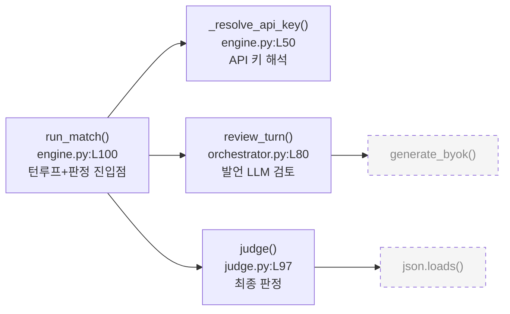

<Purpose>
Code Walkthrough는 기존 코드베이스의 특정 진입 함수(또는 파일)에서 시작하여 호출 흐름을 자동으로 추적하고, Mermaid 다이어그램으로 전체 흐름을 시각화한 뒤, 함수 하나씩 AI가 설명하고 사용자가 질문할 수 있는 인터랙티브 코드 워크스루 스킬이다.

**코드 수정이 목적이 아니다.** 코드베이스를 처음 접하거나 특정 흐름을 이해하고 싶은 개발자가 능동적으로 이해하는 것이 목적이다.

핵심 메커니즘:
1. 진입 함수(또는 파일)를 파악한다 — 사용자가 직접 지정하거나 AI가 후보를 제안한다.
2. Glob/Grep/Read로 프로젝트 내부 콜 그래프를 추적한다 (외부 라이브러리는 스탑).
3. 전체 흐름을 시각화한다 — tldraw 캔버스(우선) → Figma MCP → Mermaid 코드블록(폴백) 순으로 시도한다.
4. tldraw 사용 시: 워크스루 진행 중 현재 설명 함수 노드를 강조(노란색)하여 시각적 지도로 활용한다.
5. 함수마다 AI 설명 → 사용자 Q&A 허용 → "다음" 선택 시 진행 (하드 블락).
6. 흐름 종단 도달 시 자동 종료 또는 사용자 "중단/저장" 선택으로 종료한다.
7. 워크스루 결과를 `.omc/walkthroughs/` 아래에 Mermaid 파일과 이해 요약 문서로 저장한다.
</Purpose>

<Use_When>
- 코드베이스를 처음 접하고 어디서 무엇이 어떻게 동작하는지 이해하고 싶을 때
- "walkthrough", "코드 흐름 설명", "이 함수부터 따라가줘", "콜 그래프 보여줘" 같은 요청이 들어올 때
- 특정 기능의 실행 경로를 시각적으로 파악하고 싶을 때
- 코드 리뷰나 리팩토링 전에 흐름을 먼저 이해해두고 싶을 때
- 팀 내 지식 공유나 온보딩 문서로 워크스루 결과를 저장하고 싶을 때

**기존 스킬들과의 차별점:**
- **code-audit-interview**: Claude가 이슈를 발견하고 수정까지 진행 → 코드를 *고치는* 것이 목적
- **refactor-interview**: 사용자가 리팩토링 방향을 알고 시작 → 변경 사항을 *납득하고 실행*하는 것이 목적
- **code-walkthrough**: 코드를 *전혀 수정하지 않음* → 흐름을 *이해*하는 것이 유일한 목적
</Use_When>

<Do_Not_Use_When>
- 코드의 문제점을 찾고 수정하고 싶을 때 -- code-audit-interview를 사용하세요
- 특정 리팩토링 계획을 실행하고 싶을 때 -- refactor-interview를 사용하세요
- 코드 이해 없이 바로 구현이나 수정이 목적일 때 -- executor 또는 ralph를 사용하세요
- 무한 재귀 함수처럼 콜 그래프 추적이 불가능한 경우 (순환 탐지 후 경고로 대체)
</Do_Not_Use_When>

<Why_This_Exists>
AI 코드 어시스턴트는 코드를 수정하거나 이슈를 찾는 데 특화되어 있다. 하지만 개발자가 가장 먼저 필요한 것은 "이 코드가 어떻게 동작하는가"를 이해하는 것이다. 기존 스킬들은 이해보다 수정에 초점이 맞춰져 있어, 코드 흐름을 따라가면서 하나씩 물어볼 수 있는 인터랙티브한 경험이 없었다.

Code Walkthrough는 이 문제를 구조적으로 해결한다:
- Glob/Grep/Read로 실제 코드를 스캔하여 콜 그래프를 추적한다 (추측 금지).
- Mermaid 다이어그램으로 전체 흐름을 한눈에 보여준다.
- 함수 하나하나를 AI가 설명하고, 사용자가 이해할 때까지 Q&A를 허용한다.
- "다음" 없이 진행 불가 원칙으로 빠른 훑기를 방지한다.
- 워크스루 결과를 `.omc/walkthroughs/`에 저장하여 팀 지식 공유 문서로 활용할 수 있다.
</Why_This_Exists>

<Execution_Policy>
- 코드를 수정하지 않는다 — Read/Glob/Grep/Write(출력 저장)만 사용, Edit/Bash(코드 변경) 금지
- 콜 그래프는 반드시 Glob/Grep/Read로 실제 코드를 스캔하여 추적한다 (추측 금지)
- 외부 라이브러리(SQLAlchemy, httpx, redis 등) 함수 호출은 탐색 중단 + Mermaid 점선 노드로 표시
- 순환 참조(A→B→A) 감지 시 경고 표시 후 더 이상 재귀하지 않는다
- 한 번에 하나의 함수만 설명한다 — 여러 함수를 동시에 설명하지 않는다
- "다음" 선택 전까지 다음 함수로 절대 진행하지 않는다 (하드 블락)
- "건너뛰기" 선택지는 절대 제공하지 않는다
- 인터뷰 상태를 `state_write`로 저장하여 세션 중단/재개를 지원한다
</Execution_Policy>

<Steps>

## Phase 1: 진입점 파악

**목적:** 워크스루 시작점이 되는 파일/함수를 결정하고, 콜 그래프 초기 추적을 시작한다.

### Step 1-1: 입력 파싱 및 세션 확인

1. `{{ARGUMENTS}}`를 파싱한다:
   - `<파일경로>:<함수명>` → 지정된 함수에서 시작
   - `<파일경로>` → 파일의 주요 진입 함수를 AI가 탐지
   - `--boundary <경계경로>` → 탐색 경계 지정 (기본: 프로젝트 전체 내부)
   - `--comprehension-score` → 이해도 추적 활성화 (함수별 이해도 스코어링 + 히트맵 생성)
   - 인수 없음 → Step 1-2로 이동 (AI 자동 탐지)

2. `state_read`로 기존 세션을 확인한다:
   - 진행 중인 세션이 있으면 `AskUserQuestion`으로 재개 여부를 묻는다:
     - "이전 워크스루 세션을 이어서 진행할까요?" → 마지막 진행 노드부터 재개
     - "새로 시작할까요?" → 기존 상태 초기화

### Step 1-2: 진입 함수 탐지 (인수 없을 때)

AI가 Glob/Grep으로 코드베이스를 스캔하여 주요 진입 함수 후보를 제안한다:

- `main.py`, `app.py`, `server.py` 같은 메인 파일 탐색
- API 라우터 함수, 이벤트 핸들러, 스케줄러 진입점 탐지
- 파일 크기, 호출 빈도(피호출 횟수가 적고 호출 횟수가 많은 함수)로 후보 선정

```
주요 진입 함수 후보:
[1] backend/app/main.py — create_app() (FastAPI 앱 초기화)
[2] backend/app/services/debate/engine.py — run_match() (토론 엔진 진입점)
[3] backend/app/services/debate/matching_service.py — ready_up() (매칭 완료 처리)
[4] backend/app/api/debate_matches.py — stream_match() (SSE 스트리밍 엔드포인트)
[5] 직접 입력...
```

`AskUserQuestion`으로 진입 함수를 선택받는다.

### Step 1-3: 콜 그래프 초기 추적 (1~2레벨)

Glob/Grep/Read로 진입 함수에서 시작하는 콜 그래프를 추적한다:

**탐색 범위 기준:**
- 프로젝트 내부 함수: 탐색 계속 (import된 로컬 모듈의 함수)
- 외부 라이브러리: 탐색 중단 (SQLAlchemy, httpx, redis, fastapi, openai 등)
- `--boundary` 지정 시: 해당 경로 내 함수까지만 탐색

**순환 참조 감지:**
- 방문한 함수 목록을 추적하여 이미 방문한 함수 재방문 시 순환으로 처리
- `visited_nodes` 집합에 추가 전 존재 여부 확인

**탐색 예시:**
```
run_match()
  ├─ _resolve_api_key()       [내부 — 탐색]
  ├─ LLM 호출()               [외부: InferenceClient — 스탑]
  ├─ review_turn()            [내부 — 탐색]
  │   └─ generate_byok()      [외부: InferenceClient — 스탑]
  └─ judge()                  [내부 — 탐색]
      └─ json.loads()         [외부: stdlib — 스탑]
```

### Step 1-4: 초기 상태 저장

`state_write`로 워크스루 세션을 저장한다:

```json
{
  "active": true,
  "current_phase": "code-walkthrough",
  "state": {
    "session_id": "<uuid>",
    "entry_point": {"file": "engine.py", "function": "run_match"},
    "boundary": null,
    "call_graph": {
      "root": "run_match",
      "nodes": [
        {"name": "run_match", "file": "engine.py", "line_range": [100, 200], "status": "pending"},
        {"name": "_resolve_api_key", "file": "engine.py", "line_range": [50, 70], "status": "pending"}
      ],
      "edges": [{"from": "run_match", "to": "_resolve_api_key"}],
      "external_nodes": ["InferenceClient.generate_byok", "json.loads"],
      "cycle_nodes": []
    },
    "current_node_index": 0,
    "visited_nodes": [],
    "qa_log": [],
    "render_mode": "tldraw|figma|mermaid",
    "tldraw_node_ids": {}
  }
}
```

---

## Phase 2: 콜 그래프 시각화

**목적:** Phase 1에서 추적한 콜 그래프를 시각화한다. tldraw → Figma MCP → Mermaid 코드블록 순으로 폴백한다.

### Step 2-1: 다이어그램 규칙

| 노드 유형 | Mermaid 스타일 | 의미 |
|-----------|---------------|------|
| 내부 함수 (방문 예정) | `funcName["funcName()\nfile.py:L10\n한줄 역할 요약"]` | 일반 직사각형 |
| 외부 라이브러리 | `ext["external_call()"]:::external` | 점선 노드 (탐색 중단) |
| 순환 참조 | `cycle["funcName() ⚠️ 순환"]:::cycle` | 경고 노드 |
| 현재 설명 중 | 강조 표시 | 현재 워크스루 위치 |

**노드 라벨 형식 (3줄 고정):**
```
funcName()
file.py:L{시작줄번호}
한줄 역할 요약 (Read로 코드 읽은 뒤 작성, 최대 20자)
```
예: `run()\nengine.py:L153\n엔티티 로드→크레딧→판정`


```mermaid
%%{init: {'theme': 'default'}}%%
flowchart LR
    classDef external stroke-dasharray: 5 5, fill:#f5f5f5, color:#888
    classDef cycle fill:#fff3cd, stroke:#ffc107, color:#856404

    A["run_match()\nengine.py:L100\n턴루프+판정 진입점"]
    B["_resolve_api_key()\nengine.py:L50\nAPI 키 해석"]
    C["review_turn()\norchestrator.py:L80\n발언 LLM 검토"]
    D["judge()\njudge.py:L97\n최종 판정"]
    E["generate_byok()"]:::external
    F["json.loads()"]:::external

    A --> B
    A --> C
    A --> D
    C --> E
    D --> F
```

### Step 2-2: 다이어그램 렌더링 (폴백 체인)

다음 순서로 렌더링 도구를 시도한다. 성공한 도구를 세션 상태 `render_mode`에 저장한다.

**1순위: tldraw-desktop-skill**

tldraw-desktop-skill 도구가 사용 가능한지 확인한다: `<available-deferred-tools>` 또는 로드된 도구 목록에 tldraw 관련 도구 이름이 보이면 ToolSearch로 로드 후 호출한다. 보이지 않으면 즉시 2순위로 진행한다.
사용 가능하면 tldraw 캔버스에 콜 그래프를 그린다:

- **내부 함수 노드:** 흰 배경 사각형, 레이블: `"funcName()\nfile.py:L{start}\n한줄 역할"`
- **외부 스탑 노드:** 회색 배경(`#f5f5f5`) 사각형, 점선 테두리
- **엣지:** 화살표, 호출 방향
- **레이아웃:** 좌→우(LR), 계층별 x 간격 250px, 노드 y 간격 80px, 시작점 (100, 100)

```
render_mode = "tldraw"
📊 콜 그래프를 tldraw에 렌더링했습니다.
   tldraw 캔버스에서 전체 흐름을 확인하세요. 워크스루는 아래 채팅에서 계속됩니다.
```

**2순위: Figma MCP** (tldraw 불가 시)

다음 두 단계를 반드시 순서대로 실행한다:

**단계 1 — 가용 여부 확인:** `<available-deferred-tools>` 목록 또는 이미 로드된 도구 목록에서 `mcp__claude_ai_Figma__generate_diagram` 이름이 보이는지 확인한다.
- **보이면 → 단계 2로 진행** (deferred 상태여도 무조건 시도)
- **안 보이면 → 3순위 Mermaid로 즉시 폴백**

**단계 2 — 로드 & 호출:** ToolSearch로 스키마를 로드한 뒤 즉시 호출한다.

```
ToolSearch("select:mcp__claude_ai_Figma__generate_diagram")
→ 성공: mcp__claude_ai_Figma__generate_diagram(name=..., mermaidSyntax=...) 호출
→ 실패(에러/타임아웃): 조용히 3순위 Mermaid로 폴백
```

FigJam flowchart는 내부 함수 노드(3줄 라벨)와 외부 스탑 노드(점선)를 포함한다. (정적 렌더링 — 진행 중 강조 없음)

```
render_mode = "figma"
📊 콜 그래프를 Figma에 렌더링했습니다. (노드 강조 기능 없음)
   FigJam 링크: {mcp 도구가 반환한 링크}
```

**3순위: Mermaid 코드블록** (tldraw·Figma 모두 불가 시)

```
render_mode = "mermaid"
📊 콜 그래프 (tldraw/Figma 미감지 — Mermaid로 표시)

[Mermaid 코드블록]

총 탐색 함수: {N}개
외부 스탑: {M}개 ({라이브러리명 목록})
순환 참조: {K}개 (있을 경우)
```

---

렌더링 완료 후 `AskUserQuestion`으로 시작 여부를 확인한다:
- "다이어그램대로 워크스루를 시작할까요?"
- "탐색 범위를 조정해주세요: {요청}"
- "특정 경로만 따라가고 싶습니다: {경로}"

---

## Phase 3: 함수별 워크스루 루프

**목적:** 콜 그래프의 각 함수를 방문 순서대로 하나씩 설명하고, 사용자가 Q&A 후 "다음"을 선택해야만 진행한다.

### Step 3-1: 현재 함수 설명

방문 순서대로 함수를 하나씩 선택하여 설명한다:

0. **tldraw 노드 강조** (`render_mode == "tldraw"` 일 때만):
   - 이전 함수 노드가 있으면 기본 색상(흰 배경)으로 복원한다.
   - 현재 함수 노드를 노란 배경(`#FFF3CD`)으로 변경한다.
   - tldraw를 사용하지 않는 경우(Figma/Mermaid 폴백) 이 단계를 스킵한다.

1. **위치 제시:**
   ```
   [3/8] 함수: review_turn() | orchestrator.py:L80-140
   ```

2. **실제 코드 읽기:** `Read` 도구로 해당 줄 범위를 읽어 표시한다 (생략 없이 전체).

3. **AI 설명 구조** (4가지 관점):
   - **역할:** 이 함수가 시스템에서 담당하는 책임
   - **입력/출력:** 파라미터와 반환값의 의미
   - **핵심 로직:** 함수 내부의 주요 처리 흐름
   - **호출 컨텍스트:** 어디서 호출되고 결과가 어떻게 사용되는지

   ```
   📌 review_turn() — orchestrator.py:L80-140

   **역할:** 에이전트 발언의 논리적 오류·규칙 위반을 LLM으로 검토하고 벌점을 계산합니다.

   **입력:**
   - turn (DebateTurnLog): 검토할 발언 로그
   - context (list[DebateTurnLog]): 이전 발언 히스토리

   **출력:**
   - dict: {penalties, penalty_total, review_result, is_blocked}

   **핵심 로직:**
   1. REVIEW_SYSTEM_PROMPT + 발언 텍스트로 LLM 호출
   2. LLM 응답을 JSON 파싱하여 위반 항목 추출
   3. LLM_VIOLATION_PENALTIES 테이블로 벌점 계산
   4. penalty_total > 0이면 is_blocked=True

   **호출 컨텍스트:**
   - run_match()의 턴 루프에서 매 발언 직후 호출
   - asyncio.gather()로 A 검토와 B 발언 생성을 병렬 실행
   ```

4. **Conditional Branch 추적:**
   함수에 `if/else`, `try/catch`, `match/case` 분기가 있을 때:
   ```
   이 함수에 분기가 있습니다:
   (A) 정상 경로 — API 키가 유효할 때
   (B) 에러 경로 — API 키 없을 때 예외 발생
   어떤 경로를 먼저 살펴볼까요?
   ```
   선택한 경로를 설명하고, 미탐색 경로는 `[?]`로 표시.
   설명 후 "다른 경로도 볼까요?" 선택지 제공.

5. **현재 위치 표시기:**
   ```
   진행: [✓] run_match [✓] _resolve_api_key [▶] review_turn(A) [?] review_turn(B) [ ] judge
   ```

### Step 3-2: 하드 블락 Q&A

`AskUserQuestion`으로 사용자 응답을 받는다.

**질문 형식:**
```
review_turn()에 대한 질문이 있으신가요?
```

**선택지 (고정, "건너뛰기" 절대 없음):**

1. **"다음 함수로 진행해주세요."**
   → 현재 노드: PENDING → VISITED
   → 진행 표시기 `[▶]` → `[✓]`
   → 다음 노드로 이동

2. **"질문: {구체적 질문}"**
   → AI가 해당 질문에 답변 (코드 스니펫, 실행 흐름, 관련 함수 등 추가 설명)
   → 동일 함수에서 Q&A 계속 (라운드 +1)
   → 다시 선택지 제시

3. **"이 함수의 호출처를 더 보여주세요."**
   → Grep으로 이 함수를 호출하는 모든 곳을 스캔하여 추가 컨텍스트 제공
   → 동일 함수에서 Q&A 계속

4. **"이 함수 북마크해주세요. {메모}"**
   → 함수를 북마크 목록에 추가, 메모와 함께 저장
   → Phase 4 요약에 "북마크 함수 목록" 섹션으로 포함

5. **"이 함수를 code-audit-interview로 넘겨주세요."**
   → 현재 워크스루 상태를 `state_write`로 저장
   → `Skill("code-audit-interview")` 호출하여 해당 함수 파일:줄 전달
   → 감사 완료 후 워크스루 재개 가능

6. **"관련 함수 [{함수명}]을 먼저 설명해주세요."**
   → 순서를 조정하여 요청한 함수를 현재 다음으로 이동
   → 현재 함수는 PENDING 상태 유지, 다음 설명 후 돌아옴

5. **"중단하고 지금까지 결과를 저장해주세요."**
   → Phase 4 종료 & 저장으로 이동

### Step 3-3: Q&A 라운드 제한

같은 함수에서 지나치게 많은 라운드가 진행될 경우:
- **10 라운드 도달 시:** "이 함수에서 10번 대화했습니다. 다음 함수로 넘어가시겠습니까, 계속하시겠습니까?" 라는 안내를 추가하여 제시

### Step 3-4: 상태 저장

`AskUserQuestion` 응답마다 `state_write`로 상태를 저장한다.

---

## Phase 4: 종료 & 저장

**목적:** 워크스루가 완료되면 Mermaid 파일과 이해 요약 문서를 저장한다.

### Step 4-1: 종료 트리거

다음 조건 중 하나가 충족되면 종료 단계로 진입한다:
- **자동 종료:** 콜 그래프의 마지막 노드를 방문하고 사용자가 "다음"을 선택
- **사용자 중단:** "중단하고 저장" 선택

### Step 4-2: 이해 요약 문서 생성 (`.omc/walkthroughs/<slug>.md`)

```markdown
# {진입 함수} 워크스루 요약

## 메타데이터
- 워크스루 일시: {date}
- 진입점: {file}:{function}
- 탐색 경계: {boundary or "프로젝트 내부 전체"}
- 방문 함수: {visited}개 / 전체 {total}개
- 외부 스탑: {external_count}개
- 순환 참조: {cycle_count}개

## 콜 그래프 요약

{방문한 노드 목록 (트리 구조로 표현)}

## 이해도 히트맵 (--comprehension-score 사용 시)

| 함수 | 파일 | 이해도 | 상태 |
|------|------|--------|------|
| {func()} | {file:L#} | 1.0 명확 | |
| {func()} | {file:L#} | 0.5 질문있음 | 복습 권장 |
| {func()} | {file:L#} | 0.0 이해불가 | 재학습 필요 |

평균 이해도: {avg:.1f}/1.0

## 북마크 함수 목록

| 함수 | 파일 | 메모 |
|------|------|------|
| {func()} | {file:L#} | {사용자 메모} |

## 미탐색 분기 목록

| 함수 | 미탐색 경로 | 설명 |
|------|-------------|------|
| {func()} | B경로 | 에러/예외 경로 미탐색 |

## 함수별 이해 요약

### 1. {function_name}() — {file}:{line_range}
**역할:** {one-line 역할 요약}
**Q&A 기록:** {Q&A가 있었던 경우만}
- Q: {질문}
- A: {핵심 답변 요약}

### 2. ...

## 외부 스탑 목록
- {external_function} — {이유: 외부 라이브러리}

## 순환 참조 경고
{있을 경우만}
- {A()} → {B()} → {A()} 순환 감지

## 이해 요약
{전체 흐름에 대한 AI의 종합 설명 — 이 코드가 전체적으로 어떻게 동작하는지}
```

### Step 4-3: Mermaid 다이어그램 파일 저장 (`.omc/walkthroughs/<slug>.mmd`)

Phase 2에서 생성한 Mermaid 다이어그램을 `.mmd` 파일로 저장한다:

```
%%{init: {'theme': 'default'}}%%
flowchart LR
    ...
```

### Step 4-4: 파일 저장

`Write` 도구로 저장한다:
- `{slug}`: 진입 함수명과 파일명으로 kebab-case 생성 (예: `engine-run-match`, `orchestrator-review-turn`)
- 동일 slug가 이미 존재하면 타임스탬프 suffix 추가

### Step 4-5: 완료 메시지

```
✅ 워크스루 완료

방문한 함수: {N}개 / {total}개
미방문: {skipped}개 (중단으로 인해)

저장된 파일:
- .omc/walkthroughs/{slug}.md (이해 요약)
- .omc/walkthroughs/{slug}.mmd (Mermaid 다이어그램)

다음 단계:
- 다른 진입점으로 새 워크스루 시작: /walkthrough <파일>:<함수>
- 저장된 다이어그램 활용: Mermaid Live Editor나 IDE 플러그인으로 열람
```

</Steps>

<Tool_Usage>
- **AskUserQuestion**: 진입 함수 선택, 각 함수 Q&A, 종료 선택에 사용. 하드 블락의 핵심 도구. 한 번에 하나의 질문만.
- **Glob**: 코드베이스 파일 구조 탐색, 진입점 후보 탐색 (main.py, router 파일 등)
- **Grep**: 함수 정의 위치 탐색, 함수 호출처 확인, import 관계 분석, 외부 라이브러리 판별
- **Read**: 각 함수의 실제 코드 전체 읽기 (생략 없이) — AI 설명의 기반
- **Write**: 워크스루 결과 저장 (`.omc/walkthroughs/<slug>.md`, `.omc/walkthroughs/<slug>.mmd`)
- **state_write / state_read**: 세션 저장/복원 — 중단 후 재개 지원
- **tldraw-desktop-skill 도구** (설치 시 사용 가능): 콜 그래프 노드/화살표 렌더링, 노드 색상 변경 (강조)
  - 설치: `npx skills add tmdgusya/tldraw-desktop-skill --yes --global`
  - API: `http://localhost:7236` — 도달 불가 시 자동으로 Figma → Mermaid 폴백
- **mcp__claude_ai_Figma__generate_diagram**: tldraw 불가 시 FigJam에 flowchart 생성 (정적, 강조 없음)

**절대 사용하지 않는 도구:**
- **Edit / Bash(파일 수정)**: 코드를 수정하면 안 됨

**외부 라이브러리 판별 기준:**
- Python: `site-packages`에 설치된 패키지, stdlib 모듈
- JavaScript/TypeScript: `node_modules`에 설치된 패키지
- 직접 판단: SQLAlchemy, httpx, redis, fastapi, openai, anthropic, pydantic 등 알려진 라이브러리

**탐색 전략:**
- 내부 함수 여부: `from app.` 또는 `from services.` 같은 로컬 import인지 확인
- 함수 정의: `Grep("def {function_name}")`로 파일 내 위치 탐색
- 호출처: `Grep("{function_name}(")`로 어디서 호출되는지 확인
</Tool_Usage>

<Examples>

<Good>
진입점 탐지 후 Mermaid 생성:
```
[Glob으로 backend/app/services/debate/ 탐색]
[Grep으로 "async def run_match" 검색 → engine.py:L100]
[Read로 engine.py:L100-200 읽기 → 호출 함수 목록 추출]
[Grep으로 "_resolve_api_key" 검색 → engine.py:L50]
[Grep으로 "review_turn" 검색 → orchestrator.py:L80]

📊 콜 그래프:
flowchart LR
    A["run_match()\nengine.py:L100-200"]
    B["_resolve_api_key()\nengine.py:L50-70"]
    C["review_turn()\norchestrator.py:L80-140"]
    D["generate_byok()"]:::external
    A --> B
    A --> C
    C --> D
    classDef external stroke-dasharray: 5 5
```
Why good: 실제 코드를 스캔하여 정확한 파일 경로와 줄 번호를 포함했다. 외부 라이브러리 스탑이 명확하다.
</Good>

<Good>
하드 블락 Q&A — 사용자 질문 처리:
```
[▶] 현재: review_turn() — orchestrator.py:L80-140

**역할:** 에이전트 발언의 논리·규칙 위반을 LLM으로 검토하고 벌점을 계산합니다.
...

review_turn()에 대한 질문이 있으신가요?

사용자: "질문: asyncio.gather를 왜 사용하나요?"

AI: asyncio.gather()는 A의 검토와 B의 발언 생성을 동시에 실행하기 위해 사용합니다.
    A가 발언하는 동안 B의 이전 발언을 검토하면 턴 지연이 줄어듭니다.
    engine.py:L150에서 `asyncio.gather(review_a_turn, execute_b_turn)` 패턴을 확인하세요.

review_turn()에 대한 추가 질문이 있으신가요?
```
Why good: 질문에 정확히 답하고, 관련 코드 위치(L150)를 가리켜준다. 코드를 수정하지 않는다.
</Good>

<Good>
순환 참조 감지 및 경고:
```
[탐색 중] matching_service.py → engine.py → matching_service.py (이미 방문!)

flowchart LR
    A["ready_up()\nmatching_service.py"]
    B["run_match()\nengine.py"]
    C["ready_up() ⚠️ 순환"]:::cycle
    A --> B
    B --> C
    classDef cycle fill:#fff3cd, stroke:#ffc107

⚠️ 순환 참조 감지: ready_up() → run_match() → ready_up()
   순환 지점에서 탐색을 중단하고 경고 노드로 표시합니다.
```
Why good: 순환을 감지하고 경고를 표시했다. 무한 재귀 없이 안전하게 처리했다.
</Good>

<Good>
외부 라이브러리 스탑:
```
generate_byok()는 InferenceClient의 메서드입니다.
InferenceClient는 services/llm/inference_client.py — 프로젝트 내부이므로 탐색합니다.

[Read로 inference_client.py 확인]
inference_client.py가 호출하는 openai.AsyncOpenAI() — 외부 라이브러리(openai 패키지)입니다.
탐색을 여기서 중단하고 Mermaid에서 점선 노드로 표시합니다.

flowchart LR
    A["generate_byok()\ninference_client.py"]
    B["AsyncOpenAI.create()"]:::external
    A --> B
```
Why good: 프로젝트 내부와 외부 라이브러리를 올바르게 구분했다. inference_client는 내부이므로 탐색하고, openai는 외부이므로 스탑했다.
</Good>

<Bad>
코드 수정 시도:
```
이 함수에서 버그를 발견했습니다. 수정해드릴까요?
```
Why bad: Code Walkthrough는 절대 코드를 수정하지 않는다. 이해만이 목적이다.
</Bad>

<Bad>
건너뛰기 선택지 제공:
```
이 함수에 대한 질문이 있으신가요?
1. 다음 함수로 진행
2. 질문하기
3. 이 함수는 건너뛰겠습니다   ← 절대 금지
4. 중단
```
Why bad: "건너뛰기"는 이해 없는 진행을 허용한다. 하드 블락 원칙에 위배된다.
</Bad>

<Bad>
스캔 없이 추측으로 설명:
```
이 함수는 아마 LLM을 호출하고 결과를 반환할 것 같습니다.
데이터베이스에도 저장하는 것으로 보입니다.
```
Why bad: Read 도구로 실제 코드를 읽지 않고 추측했다. 반드시 실제 코드를 읽고 설명해야 한다.
</Bad>

<Bad>
여러 함수를 한꺼번에 설명:
```
이번 단계에서 run_match(), review_turn(), judge() 세 함수를 함께 설명합니다.
```
Why bad: 한 번에 하나의 함수만 설명한다. 여러 함수를 동시에 설명하면 Q&A 집중도가 떨어진다.
</Bad>

</Examples>

<Escalation_And_Stop_Conditions>

### 탐색 범위 제한

- **함수 50개 초과:** "콜 그래프가 50개 함수를 초과했습니다. --boundary 옵션으로 범위를 좁히거나, 특정 경로만 따라갈까요?" `AskUserQuestion`으로 확인
- **탐색 깊이 제한:** 기본 5레벨 깊이까지 탐색. 더 깊어지면 "탐색 깊이 5레벨을 초과했습니다. 이 경로를 더 따라가겠습니까?" 확인

### 순환 참조

- A→B→A 패턴 감지 시: 경고 노드로 표시하고 탐색 중단 (무한 재귀 방지)
- 순환 경고: `⚠️ 순환 참조: {A} → {B} → {A} — 탐색 중단`

### 중단 조건

- **사용자가 "중단", "저장", "그만":** 즉시 중단, 현재까지 결과를 Phase 4로 저장
- **모든 노드 방문 완료:** 자동으로 Phase 4 종료 & 저장으로 전환
- **파일을 찾을 수 없는 경우:** "파일 {path}를 찾을 수 없습니다. 경로를 확인해주세요." 후 새 진입점 선택

### 세션 재개

- `/walkthrough`를 다시 호출하면 `state_read`로 이전 세션 확인
- 이전 세션이 있으면 재개 여부를 `AskUserQuestion`으로 묻고, 마지막 VISITED 노드 다음부터 진행
- 진행 표시기를 먼저 출력하여 현재 위치 확인

### 외부 라이브러리 처리

- 표준 라이브러리(json, os, asyncio 등): 스탑 + 점선 노드 (추가 설명 없음)
- 알려진 외부 패키지(openai, httpx, sqlalchemy, redis 등): 스탑 + 점선 노드 + 라이브러리명 표시
- 불확실한 경우: Grep으로 `site-packages` 또는 `node_modules` 여부 확인

</Escalation_And_Stop_Conditions>

<Final_Checklist>
- [ ] `/walkthrough <path>` 또는 `/walkthrough <path>:<function>` 으로 호출 가능
- [ ] 인수 없이 호출 시 AI가 Glob/Grep으로 주요 진입 함수 후보를 탐지하고 AskUserQuestion으로 선택받음
- [ ] Glob/Grep/Read로 실제 코드를 스캔하여 콜 그래프를 추적했는가 (추측 금지)
- [ ] Mermaid flowchart LR 다이어그램을 생성하여 대화 중 출력했는가
- [ ] 외부 라이브러리 함수 호출이 점선 노드(:::external)로 표시되고 탐색이 중단되었는가
- [ ] 순환 참조(A→B→A) 감지 시 경고 노드(:::cycle)로 표시하고 재귀를 중단했는가
- [ ] 각 함수마다 Read 도구로 실제 코드를 읽고 4가지 관점(역할/입출력/핵심 로직/호출 컨텍스트)으로 설명했는가
- [ ] "다음" 선택 없이 다음 함수로 진행하지 않았는가 (하드 블락)
- [ ] "건너뛰기" 선택지가 없는가
- [ ] 흐름 종단 도달 시 자동 종료 또는 사용자 "중단" 선택으로 종료했는가
- [ ] `.omc/walkthroughs/<slug>.md` 이해 요약 문서가 저장되었는가
- [ ] `.omc/walkthroughs/<slug>.mmd` Mermaid 다이어그램이 저장되었는가
- [ ] 코드를 수정하지 않았는가 (Edit/Bash 코드 변경 사용 없음)
- [ ] 세션 상태가 `state_write`로 저장되었는가
</Final_Checklist>

<Advanced>

## 세션 상태 구조

```json
{
  "active": true,
  "current_phase": "code-walkthrough",
  "state": {
    "session_id": "<uuid>",
    "entry_point": {
      "file": "backend/app/services/debate/engine.py",
      "function": "run_match"
    },
    "boundary": null,
    "call_graph": {
      "root": "run_match",
      "nodes": [
        {
          "name": "run_match",
          "file": "engine.py",
          "line_range": [100, 200],
          "status": "visited",
          "qa_rounds": 3
        },
        {
          "name": "_resolve_api_key",
          "file": "engine.py",
          "line_range": [50, 70],
          "status": "pending",
          "qa_rounds": 0
        }
      ],
      "edges": [
        {"from": "run_match", "to": "_resolve_api_key"}
      ],
      "external_nodes": [
        {"name": "InferenceClient.generate_byok", "library": "app/services/llm (external call)"}
      ],
      "cycle_nodes": []
    },
    "current_node_index": 1,
    "visited_nodes": ["run_match"],
    "qa_log": [
      {
        "function": "run_match",
        "round": 1,
        "question": "asyncio.gather를 왜 사용하나요?",
        "answer_summary": "A 검토와 B 발언 생성을 병렬 실행하여 턴 지연 단축"
      }
    ]
  }
}
```

## 워크스루 탐색 전략

### 방문 순서 (BFS vs DFS)

기본 DFS(깊이 우선) 방식으로 탐색한다:
- 진입 함수 → 첫 번째 호출 함수 → 그 함수의 호출 함수 → ... → 리프 노드까지
- 리프 노드 도달 후 백트랙하여 다음 경로 탐색

사용자가 "중요한 함수 먼저"를 요청하면 BFS 전환:
- 진입 함수의 모든 직접 호출 함수를 먼저 방문
- 그 다음 레벨을 방문

### `--boundary` 옵션 사용 예시

```bash
/walkthrough backend/app/services/debate/engine.py:run_match --boundary backend/app/services/debate/
```

이 경우 `backend/app/services/debate/` 밖의 함수는 점선 노드로 처리된다:
- `backend/app/services/llm/inference_client.py` → 경계 밖 → 점선 노드
- `backend/app/services/debate/orchestrator.py` → 경계 안 → 탐색 계속

### code-audit-interview와의 상호 보완

```
code-walkthrough:  코드를 이해한다 (수정 없음)
      ↓ (이해 완료)
code-audit-interview: 이슈를 찾고 수정한다

권장 워크플로우:
1. /walkthrough — 코드 흐름 이해
2. /code-audit-interview — 이해를 바탕으로 이슈 발견 및 수정
```

## slug 생성 규칙

```
{파일명(확장자 제외)}-{함수명}
예:
  engine.py:run_match → engine-run-match
  orchestrator.py:review_turn → orchestrator-review-turn
  main.py → main-entrypoint
  (동일 slug 중복 시) engine-run-match-20260316-143022
```

</Advanced>

Task: {{ARGUMENTS}}
