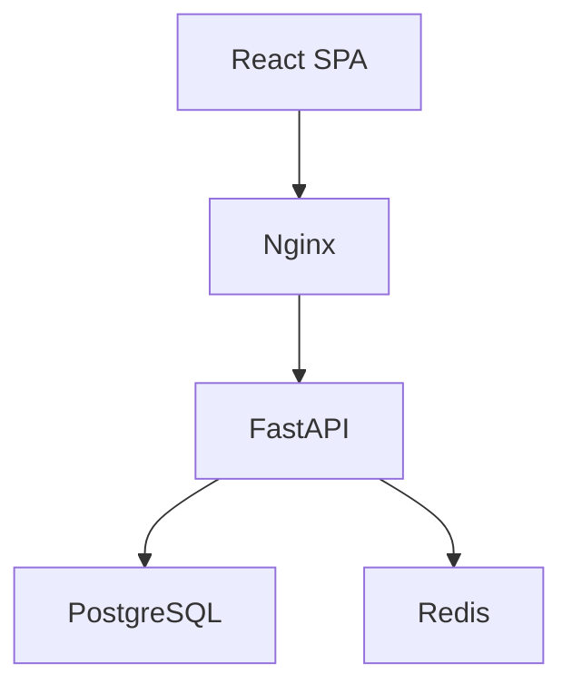

# Doc Interview

<Purpose>
Doc Interview는 개발 프로젝트에서 필요한 8종 문서를 소크라테스식 심층 인터뷰로 생성한다. 코드베이스를 먼저 스캔하여 사실을 추출하고, 코드가 답할 수 없는 것(왜, 트레이드오프, 대상 독자)만 인터뷰로 수집한다. 문서 유형별 완성도 차원을 정의하여 수학적으로 완성도를 측정하고, 섹션마다 하드 블락으로 승인을 받아 "AI가 알아서 쓴 문서"가 아닌 "사용자가 납득한 문서"를 생성한다.

핵심 공식: `completeness = 1 - ambiguity`. deep-interview가 ambiguity <= 0.2에서 게이트하듯, doc-interview는 completeness >= 0.8에서 섹션 초안을 제시한다.

deep-interview 패밀리와의 관계:
```
deep-interview = "무엇을 만들지" 요구사항 정제 (출력: spec)
plan-interview = "어떻게 만들지" 설계 납득 (출력: plan)
doc-interview  = "무엇을 기록할지" 문서 생성 (출력: document — 최종 산출물)
```

핵심 메커니즘:
1. 문서 유형을 감지하고 코드베이스를 스캔하여 사실을 추출한다.
2. 문서 유형별 완성도 차원으로 섹션별 스코어링한다.
3. 가장 약한 차원을 타겟하여 한 번에 하나씩 질문한다.
4. 섹션 완성도 >= 0.8 도달 시 초안을 제시하고 하드 블락 승인을 받는다.
5. 도전 에이전트(악마의 변호인, 완성도 감사관, 독자 시뮬레이터)로 품질을 검증한다.
6. 최종 문서를 조립하고 섹션별 교차 검토로 2중 승인한다.
7. `.omc/docs/{doc-type}-{slug}.md`에 저장한다.

출력: `.omc/docs/{doc-type}-{slug}.md`
</Purpose>

<Use_When>
- "문서 작성", "doc-interview", "PRD 만들어줘", "기술 설계서 작성해줘" 같은 요청이 들어올 때
- "API 문서", "ADR 작성", "테스트 계획서", "배포 가이드", "온보딩 문서", "변경 이력서" 키워드 사용 시
- 코드베이스의 특정 기능/모듈/시스템에 대한 문서가 필요할 때
- 기존 코드를 문서화하되 빠진 정보를 인터뷰로 보충하고 싶을 때
- 신규 기능 개발 전에 PRD나 기술 설계서를 먼저 작성하고 싶을 때
- PR이나 릴리스 전에 변경 이력서를 정리하고 싶을 때
</Use_When>

<Do_Not_Use_When>
- 요구사항 자체가 모호할 때 -- deep-interview를 먼저 실행하세요
- 설계를 납득하고 싶을 때 -- plan-interview를 사용하세요
- 이미 완성된 문서를 수정할 때 -- editor로 직접 편집하세요
- "그냥 빨리 문서 만들어줘", "질문 없이 작성해" -- 사용자 의사를 존중하고 writer 에이전트로 직접 생성
- 단순 README 업데이트 -- executor로 직접 실행하세요
- 코드 이슈를 찾고 수정하고 싶을 때 -- code-audit-interview를 사용하세요
</Do_Not_Use_When>

<Why_This_Exists>
AI는 문서를 즉시 생성할 수 있다. 문제는 두 가지다:
1. AI가 추측으로 채운 문서는 실제 요구사항과 다르다 — "왜"와 "트레이드오프"는 코드에 없다.
2. 코드에서 추출할 수 있는 사실을 사용자에게 다시 묻는다 — 시간 낭비.

Doc Interview는 이 문제를 구조적으로 해결한다:
- 코드베이스를 먼저 스캔하여 사실을 추출한다 (brownfield-first).
- 코드가 답할 수 없는 것만 인터뷰한다 (why, trade-offs, audience, constraints).
- 문서 유형별 완성도 차원을 정의하여 수학적으로 완성도를 측정한다.
- 섹션마다 하드 블락으로 승인을 받아 이해 없는 문서 생성을 방지한다.
- 2중 승인(섹션 인터뷰 + 최종 교차 검토)으로 일관성을 보장한다.
</Why_This_Exists>

<Execution_Policy>
- 한 번에 하나의 질문만 던진다 -- 여러 질문을 배치하지 않는다
- 가장 약한 완성도 차원을 타겟한다 -- 매 라운드 타겟 차원과 이유를 명시한다
- 코드베이스 사실은 도구로 먼저 확인한다 -- 코드가 이미 답하는 것을 사용자에게 묻지 않는다
- 섹션 승인 없이 다음 섹션으로 진행하지 않는다 (하드 블락)
- "건너뛰기" 옵션은 절대 제공하지 않는다
- 완성도가 임계값(기본 0.8) 이상이 될 때까지 해당 섹션의 Q&A를 반복한다
- 대화 중에는 텍스트 진행 표시기를 사용한다 -- Mermaid는 최종 문서에만 포함한다
- 인터뷰 상태를 `state_write`로 저장하여 세션 중단/재개를 지원한다
- 백트래킹(이전 섹션으로 복귀)을 허용하되, 이후 섹션의 APPROVED 상태를 리셋한다
</Execution_Policy>

<Steps>

## Phase 1: 문서 유형 감지 + 코드베이스 스캔

**목적:** 생성할 문서 유형을 결정하고, 코드베이스에서 사실을 추출한다.

### Step 1-1: 입력 파싱 및 세션 확인

1. `{{ARGUMENTS}}`에서 플래그와 설명을 파싱한다:
   - `--type <type>`: 문서 유형 직접 지정
   - `--quick`: 빠른 모드 (완성도 임계값 0.6으로 하향, 라운드 캡 50% 축소)
   - 나머지 텍스트: 프로젝트/기능 설명

2. `--type`이 없으면 키워드 자동 감지:
   | 키워드 | 문서 유형 |
   |--------|-----------|
   | "PRD", "요구사항", "기능 명세", "유저 스토리" | `prd` |
   | "기술 설계", "아키텍처", "설계서", "tech design" | `tech-design` |
   | "API 문서", "엔드포인트", "스웨거", "swagger" | `api-doc` |
   | "ADR", "의사결정", "아키텍처 결정" | `adr` |
   | "테스트 계획", "테스트 전략", "QA 계획" | `test-plan` |
   | "배포", "deploy", "운영 가이드" | `deploy-guide` |
   | "온보딩", "신규 입사", "시작 가이드" | `onboarding` |
   | "변경 이력", "changelog", "릴리스 노트" | `changelog` |

3. 자동 감지 실패 시 `AskUserQuestion`으로 8개 문서 유형 선택지 제시.

4. `state_read`로 기존 세션 확인. 진행 중인 세션이 있으면 재개 여부 확인.

### Step 1-2: 코드베이스 탐색 (Brownfield / Greenfield 감지)

Glob으로 현재 디렉토리에 소스 코드가 존재하는지 확인한다:
- `src/**`, `app/**`, `lib/**`, `*.py`, `*.ts`, `*.js`, `package.json`, `Cargo.toml`, `pyproject.toml`
- `.git` 디렉토리 존재 여부

**감지 결과에 따른 분기:**

#### Greenfield (코드베이스 없음)

소스 파일이 없거나 빈 프로젝트인 경우:

1. `project_type: "greenfield"` 설정
2. 코드베이스 스캔을 건너뛴다 — `codebase_context.extracted_facts = {}`
3. **문서 유형 적합성 확인** — greenfield에서 생성 불가능한 문서를 필터링:

| 문서 유형 | Greenfield 가능 | 이유 |
|-----------|----------------|------|
| PRD | ✅ 최적 | 코드 전에 요구사항 정의가 자연스러움 |
| 기술 설계서 | ✅ 가능 | 구현 전 아키텍처 결정 |
| API 문서 | ⚠️ 제한적 | 스키마 초안만 가능, 구현 후 업데이트 필요 |
| ADR | ✅ 최적 | 코드 전에 의사결정 기록이 더 자연스러움 |
| 테스트 계획서 | ⚠️ 제한적 | 전략/방향만 가능, 구체적 테스트 케이스 불가 |
| 배포 가이드 | ❌ 불가 | 코드와 인프라가 없으면 작성 불가 |
| 온보딩 문서 | ❌ 불가 | 프로젝트가 없으면 온보딩할 대상이 없음 |
| 변경 이력서 | ❌ 불가 | git 이력이 없으면 변경 사항이 없음 |

불가능한 문서 유형 선택 시:
```
이 문서 유형은 코드베이스가 필요합니다.
현재 프로젝트에 소스 코드가 없어 {doc_type_ko}를 작성할 수 없습니다.

대신 다음 문서를 먼저 작성하시겠습니까?
  1. PRD (요구사항 정의) — 코드 전에 가장 적합
  2. 기술 설계서 (아키텍처 결정)
  3. ADR (의사결정 기록)
```

4. **Greenfield 전용 인터뷰 전략**:
   - 코드에서 추출할 사실이 없으므로 모든 정보를 인터뷰로 수집
   - 완성도 시작점이 낮으므로 **초기 앵커 질문**을 먼저 던진다:
     ```
     프로젝트를 이해하기 위해 3가지 기본 질문부터 시작합니다:
     1. 이 프로젝트/기능은 어떤 문제를 해결하나요?
     2. 주요 사용자/대상은 누구인가요?
     3. 기술 스택은 결정되었나요? (언어, 프레임워크, DB 등)
     ```
   - 앵커 질문으로 기본 컨텍스트를 확보한 후 섹션별 인터뷰 진행
   - `--quick` 모드 자동 권장: "코드가 없어 인터뷰가 길어질 수 있습니다. --quick 모드를 사용하시겠습니까?"

5. **Greenfield에서 라운드 캡 조정**:
   - 코드 사실 없이 모든 정보를 수집해야 하므로 라운드 캡을 1.5배로 확장:
     - LOW: 3/6, MEDIUM: 6/10, HIGH: 9/15
   - 단, `--quick` 사용 시 기본 캡 유지

#### Brownfield (코드베이스 있음)

`explore` 에이전트(haiku)로 기존 코드베이스를 스캔한다. 문서 유형별 스캔 전략:

| 문서 유형 | Glob 패턴 | Grep 패턴 | 추출 대상 |
|-----------|-----------|-----------|-----------|
| PRD | `README*`, `package.json`, `**/models/*` | `feature`, `user`, `role` | 기존 기능, 사용자 모델 |
| 기술 설계서 | `src/**`, `**/schema*`, `**/config*` | `middleware`, `service`, `repository` | 아키텍처 레이어, 스키마 |
| API 문서 | `**/routes/*`, `**/api/*`, `**/controllers/*` | `@Get`, `@Post`, `router.`, `app.get` | 엔드포인트 목록, 인증 방식 |
| ADR | `**/adr/*`, `**/decisions/*`, `ARCHITECTURE*` | `decision`, `alternative` | 기존 ADR, 기술 스택 |
| 테스트 계획서 | `**/test*`, `**/*.test.*`, `**/jest*`, `**/pytest*` | `describe`, `it(`, `test(`, `def test_` | 테스트 구조, 커버리지 |
| 배포 가이드 | `Dockerfile*`, `docker-compose*`, `.github/workflows/*`, `**/deploy*` | `deploy`, `build`, `publish` | 배포 파이프라인, 인프라 |
| 온보딩 문서 | `README*`, `CONTRIBUTING*`, `Makefile`, `package.json` | `"scripts"`, `"start"`, `"dev"` | 설정 명령어, 프로젝트 구조 |
| 변경 이력서 | `CHANGELOG*`, `package.json` | `version` | git log, 버전 정보, 마이그레이션 |

**변경 이력서 특별 처리:**
```bash
git log --oneline --since="$(git log --format=%ai -1 $(git describe --tags --abbrev=0 2>/dev/null || echo HEAD~20))" 2>/dev/null
```
최근 태그 이후의 커밋 목록을 자동 추출하여 변경 사항 초안을 생성한다.

### Step 1-3: 섹션 분해 및 복잡도 부여

문서 유형의 섹션 목록과 완성도 차원을 로드한다. 차원 weight 기반으로 복잡도 자동 부여:
- weight >= 0.25 → HIGH (6/10 라운드 캡)
- weight >= 0.15 → MEDIUM (4/7 라운드 캡)
- weight < 0.15 → LOW (2/4 라운드 캡)

**8개 문서 유형별 섹션 + 완성도 차원:**

#### PRD (Product Requirements Document)
| 섹션 | 차원 | Weight | 복잡도 |
|------|------|--------|--------|
| 배경 및 문제 정의 | problem_statement | 0.25 | HIGH |
| 대상 사용자 | target_user | 0.20 | MEDIUM |
| 기능 명세 | features | 0.25 | HIGH |
| 수용 기준 | acceptance_criteria | 0.20 | MEDIUM |
| 비목표 (Out of Scope) | non_goals | 0.10 | LOW |

#### 기술 설계서 (Technical Design Document)
| 섹션 | 차원 | Weight | 복잡도 |
|------|------|--------|--------|
| 아키텍처 개요 | architecture | 0.25 | HIGH |
| 데이터 모델 | data_model | 0.20 | MEDIUM |
| API 계약 | api_contract | 0.20 | MEDIUM |
| 에러 처리 전략 | error_handling | 0.15 | MEDIUM |
| 확장성 고려 | scalability | 0.10 | LOW |
| 보안 고려 | security | 0.10 | LOW |

#### API 문서 (API Documentation)
| 섹션 | 차원 | Weight | 복잡도 |
|------|------|--------|--------|
| 엔드포인트 목록 | endpoints | 0.30 | HIGH |
| 인증 및 권한 | auth | 0.15 | MEDIUM |
| 요청/응답 스키마 | schemas | 0.25 | HIGH |
| 에러 코드 체계 | error_codes | 0.15 | MEDIUM |
| 사용 예시 | examples | 0.15 | MEDIUM |

#### ADR (Architecture Decision Record)
| 섹션 | 차원 | Weight | 복잡도 |
|------|------|--------|--------|
| 컨텍스트 | context | 0.20 | MEDIUM |
| 결정 동인 | decision_drivers | 0.20 | MEDIUM |
| 고려한 선택지 | options | 0.25 | HIGH |
| 선택 근거 | chosen_rationale | 0.25 | HIGH |
| 예상 결과 | consequences | 0.10 | LOW |

#### 테스트 계획서 (Test Plan)
| 섹션 | 차원 | Weight | 복잡도 |
|------|------|--------|--------|
| 테스트 전략 | strategy | 0.25 | HIGH |
| 커버리지 목표 | coverage | 0.25 | HIGH |
| 엣지 케이스 | edge_cases | 0.20 | MEDIUM |
| 테스트 환경 | environment | 0.15 | MEDIUM |
| 일정 및 리소스 | timeline | 0.15 | MEDIUM |

#### 배포 가이드 (Deployment Guide)
| 섹션 | 차원 | Weight | 복잡도 |
|------|------|--------|--------|
| 사전 요건 | prerequisites | 0.20 | MEDIUM |
| 배포 단계 | steps | 0.30 | HIGH |
| 롤백 절차 | rollback | 0.25 | HIGH |
| 모니터링 | monitoring | 0.15 | MEDIUM |
| 알림 설정 | alerts | 0.10 | LOW |

#### 온보딩 문서 (Onboarding Guide)
| 섹션 | 차원 | Weight | 복잡도 |
|------|------|--------|--------|
| 환경 설정 | setup | 0.25 | HIGH |
| 아키텍처 개요 | architecture | 0.25 | HIGH |
| 핵심 개념 | key_concepts | 0.20 | MEDIUM |
| 일상 작업 | common_tasks | 0.20 | MEDIUM |
| FAQ | faq | 0.10 | LOW |

#### 변경 이력서 (Changelog / Release Notes)
| 섹션 | 차원 | Weight | 복잡도 |
|------|------|--------|--------|
| 변경 사항 | changes | 0.30 | HIGH |
| 마이그레이션 가이드 | migration | 0.25 | HIGH |
| 호환성 정보 | compatibility | 0.25 | HIGH |
| 폐기 예정 | deprecations | 0.20 | MEDIUM |

### Step 1-4: 초기 상태 저장

`state_write`로 세션을 저장한다:

```json
{
  "active": true,
  "current_phase": "doc-interview",
  "state": {
    "doc_id": "<uuid>",
    "doc_type": "tech-design",
    "doc_type_ko": "기술 설계서",
    "slug": "<kebab-case>",
    "project_type": "brownfield|greenfield",
    "initial_description": "<user input>",
    "quick_mode": false,
    "threshold": 0.8,
    "codebase_context": {
      "scanned_files": [],
      "extracted_facts": {}
    },
    "sections": [
      {
        "name": "아키텍처 개요",
        "dimension": "architecture",
        "weight": 0.25,
        "complexity": "HIGH",
        "status": "PENDING",
        "completeness": 0.0,
        "round": 0,
        "content_draft": null,
        "diagrams": [],
        "qa_log": []
      }
    ],
    "current_section_index": 0,
    "overall_completeness": 0.0,
    "total_rounds": 0,
    "challenge_modes_used": [],
    "backtrack_history": [],
    "low_quality_responses": 0
  }
}
```

### Step 1-5: 인터뷰 시작 안내

```
문서 인터뷰를 시작합니다. 섹션별로 질문하여 {doc_type_ko}를 작성합니다.
코드베이스 스캔으로 추출한 사실을 기반으로, 부족한 정보만 질문합니다.
각 섹션의 완성도가 80% 이상이 되면 초안을 제시하고 승인을 받습니다.

**문서 유형:** {doc_type_ko}
**프로젝트:** {brownfield|greenfield}
**섹션 수:** {count}개
**현재 완성도:** 0%

진행 상황:
[ ] 섹션 1: {name} [{complexity}]
[ ] 섹션 2: {name} [{complexity}]
...
```

---

## Phase 2: 섹션별 인터뷰 루프

**목적:** 각 섹션의 완성도를 충분히 높이고, 초안을 생성하여 승인을 받는다.

### Step 2-1: 완성도 스코어링

현재 섹션의 관련 차원을 0.0~1.0으로 스코어링한다 (opus, temperature 0.1):

```
Given the following interview transcript for a {doc_type_ko} document,
score completeness of section "{section_name}" on its dimension:

Document type: {doc_type_ko}
Section: {section_name}
Dimension: {dimension_name}
Transcript: {all rounds Q&A for this section}
Codebase facts: {extracted_facts relevant to this section}

Score the dimension:
- score: float (0.0-1.0)
- justification: one sentence explaining the score
- gap: what's still missing (if score < 0.9)
- weakest_aspect: the specific sub-topic that is most unclear

Respond as JSON.
```

### Step 2-2: 질문 생성

가장 약한 차원/측면을 타겟하는 질문을 생성한다.

**질문 스타일 (문서 유형별 차원에 따라):**

| 차원 유형 | 질문 스타일 | 예시 |
|-----------|-------------|------|
| 기능/동작 | "구체적으로 어떤 동작을?" | "사용자가 검색 버튼을 누르면 어떤 결과가 먼저 보여야 하나요?" |
| 기술 결정 | "왜 이 선택을?" | "PostgreSQL 대신 MongoDB를 선택한 이유가 있나요?" |
| 대상/범위 | "누구를 위해?" | "이 API를 사용하는 클라이언트는 프론트엔드만인가요, 서드파티도 포함하나요?" |
| 제약 조건 | "경계는?" | "트래픽 피크 시 초당 몇 건의 요청을 처리해야 하나요?" |
| 리스크/실패 | "실패하면?" | "배포 중 DB 마이그레이션이 실패하면 롤백 절차는 어떻게 되나요?" |
| 대안 비교 | "다른 선택지는?" | "Redis 대신 Memcached를 고려하셨나요? 선택 이유가 있나요?" |

**질문 형식:**
```
섹션 "{section_name}" | 라운드 {n} | 타겟: {dimension} ({score}) | 왜 지금: {rationale} | 완성도: {pct}%

{question}
```

### Step 2-2b: 사용자 응답 품질 감지

deep-interview 패턴을 재사용한다:

- "아무거나", "모르겠다", "알아서 해줘", "상관없어" → low-quality 감지
- 해당 라운드를 스코어링에서 제외, 다른 차원으로 전환
- `low_quality_responses` 카운터 +1
- 3회 연속 시 시나리오 기반 질문 모드로 전환:
  ```
  구체적인 예시로 질문 방식을 바꿔볼까요?
  예: "개발자 A가 처음으로 이 프로젝트를 clone하고 npm install을 실행합니다.
       그 다음에 어떤 명령어로 개발 서버를 시작하나요?"
  ```

### Step 2-3: 섹션 전환 게이트

`section_completeness >= threshold` (기본 0.8, `--quick` 시 0.6) 도달 시:

1. 인터뷰 데이터 + 코드베이스 사실을 종합하여 섹션 초안을 생성한다.
2. 초안을 사용자에게 제시한다:

```
섹션 "{section_name}" 초안을 작성했습니다. [완성도: {pct}%, 라운드: {n}]

---
{초안 내용 — 마크다운 형식}
---
```

3. `AskUserQuestion`으로 하드 블락 승인:

**선택지 (5개 고정, "건너뛰기" 절대 없음):**

1. **"승인합니다. 다음 섹션으로 진행해주세요."**
   → PENDING → APPROVED
   → 진행 표시기 `[ ]` → `[✓]`
   → 다음 섹션으로 이동

2. **"수정해주세요: {변경 요청}"**
   → 수정 반영 후 초안 재제시

3. **"이 부분을 더 자세히 작성해주세요: {구체적 부분}"**
   → 해당 부분 보강 후 재제시

4. **"정보가 빠졌습니다. 다시 질문해주세요."**
   → 추가 Q&A 라운드 진행

5. **"이전 섹션 [{name}]으로 돌아가고 싶습니다."**
   → 백트래킹 실행 (Step 2-5)

### Step 2-4: 라운드 캡 규칙

| 섹션 복잡도 | Soft cap (경고) | Hard cap (강제 진행) |
|-------------|-----------------|---------------------|
| LOW | 2 라운드 | 4 라운드 |
| MEDIUM | 4 라운드 | 7 라운드 |
| HIGH | 6 라운드 | 10 라운드 |

`--quick` 모드: 모든 캡을 50% 축소 (LOW: 1/2, MEDIUM: 2/4, HIGH: 3/5)

**soft cap 도달 시:**
```
같은 섹션에서 {n}번 질문했습니다. 다른 접근으로 질문할까요?
```

**hard cap 도달 시:**
```
이 섹션은 {n}라운드 동안 완성도 {pct}%에 도달했습니다.
현재 상태로 초안을 생성하고 다음 섹션으로 진행합니다.
최종 문서에 이 섹션이 [미완성] 표시됩니다.
```
→ PENDING → FORCED, 진행 표시기 `[!]`

### Step 2-5: 백트래킹 메커니즘

사용자가 "이전 섹션으로 돌아가기"를 선택한 경우:

1. 지정한 섹션: APPROVED → ACTIVE (`[✓]` → `[▶]`)
2. 그 이후 APPROVED 섹션들: APPROVED → PENDING (`[✓]` → `[ ]`)
3. 인터뷰 로그에 백트래킹 사유와 영향 섹션 기록

### Step 2-6: 진행 표시기 업데이트

```
문서 작성 진행 상황 ({doc_type_ko}):
[✓] 섹션 1: 배경 및 문제 정의 [HIGH] (승인 완료, 3라운드)
[▶] 섹션 2: 대상 사용자 [MEDIUM] (Q&A 진행 중, 라운드 2/4)
[ ] 섹션 3: 기능 명세 [HIGH]
[ ] 섹션 4: 수용 기준 [MEDIUM]
[!] 섹션 5: 비목표 [LOW] (hard cap 강제 진행)
```

기호 규칙:
| 기호 | 상태 | 의미 |
|------|------|------|
| `[✓]` | APPROVED | 승인 완료 |
| `[▶]` | ACTIVE | 현재 Q&A 진행 중 |
| `[ ]` | PENDING | 대기 중 |
| `[!]` | FORCED | hard cap 강제 진행 |

### Step 2-7: 상태 저장

섹션 상태가 변경될 때마다 `state_write`로 저장한다.

---

## Phase 3: 도전 에이전트 (Challenge Agents)

전체 누적 라운드 수 기준으로 활성화한다. 각 모드는 1회만 사용, state에서 추적.

### 누적 라운드 8+: Devil's Advocate (악마의 변호인)

현재까지 작성된 초안에서 가장 약한 주장을 공격한다:
```
이 {section}은 {specific_weakness}를 고려하지 않았습니다.
{구체적 반례/시나리오}에서 어떻게 되나요?
예: "이 배포 가이드는 DB 마이그레이션 실패 시나리오를 다루지 않습니다.
     10만 건의 데이터가 있는 프로덕션 DB에서 마이그레이션이 중간에 실패하면?"
```

### 누적 라운드 12+ (overall completeness < 0.7): Completeness Auditor (완성도 감사관)

문서 전체를 독자 관점에서 검토한다:
```
이 문서를 처음 읽는 {target_audience}가 {section}을 읽고 바로 행동할 수 있나요?
빠진 정보:
- {gap_1}
- {gap_2}
```

### 누적 라운드 15+ (overall completeness < 0.7): Audience Simulator (독자 시뮬레이터)

3개 독자 페르소나로 문서를 검증한다:

- **신규 개발자:** "이 문서만으로 환경 설정을 할 수 있는가? 첫 PR을 올릴 수 있는가?"
- **시니어 아키텍트:** "기술적 결정의 근거가 충분한가? 확장성/성능/보안 고려가 있는가?"
- **PM/이해관계자:** "비즈니스 가치와 리스크가 명확한가? 일정과 범위가 현실적인가?"

각 페르소나에서 발견된 gap을 추가 질문으로 제시한다.

---

## Phase 4: 문서 생성 (Document Generation)

**목적:** 모든 섹션 초안을 조합하고 Mermaid 다이어그램을 삽입하여 최종 문서를 생성한다.

### Step 4-1: 문서 조립

승인/강제 진행된 모든 섹션을 하나의 마크다운 문서로 조합한다:

```markdown
# {doc_type_ko}: {project_name}

## 메타데이터
- 문서 유형: {doc_type_ko}
- 생성 일시: {timestamp}
- 프로젝트: {project_name}
- 인터뷰 라운드: {total_rounds}
- 전체 완성도: {overall_completeness}%
- 상태: {모든 섹션 APPROVED | N개 섹션 FORCED}

---

{각 섹션 내용}

---

## 인터뷰 기록
<details><summary>전체 Q&A ({total_rounds} 라운드)</summary>

### 섹션: {name}
**라운드 1:**
- Q: {question}
- A: {answer}
- 완성도: {pct}%

...
</details>
```

### Step 4-2: Mermaid 다이어그램 자동 생성

문서 유형별로 적절한 다이어그램을 자동 생성하여 삽입한다:

| 문서 유형 | 다이어그램 | Mermaid 타입 |
|-----------|-----------|-------------|
| PRD | 사용자 여정 플로우 | `flowchart LR` |
| 기술 설계서 | 아키텍처, 시퀀스, ER | `graph TB`, `sequenceDiagram`, `erDiagram` |
| API 문서 | 요청/응답 시퀀스 | `sequenceDiagram` |
| ADR | 의사결정 트리 (옵션별 분기) | `flowchart TB` |
| 테스트 계획서 | 테스트 전략 플로우 | `flowchart LR` |
| 배포 가이드 | 배포 파이프라인 | `flowchart LR` |
| 온보딩 문서 | 아키텍처 개요, 프로젝트 구조 | `graph TB` |
| 변경 이력서 | (없음) | - |

---

## Phase 5: 최종 검토 (Section-by-Section Final Review)

**목적:** 조립된 문서를 섹션별로 최종 검토하여 교차 참조 불일치를 잡는다.

### Step 5-1: 섹션별 최종 검토

각 섹션을 순서대로 최종 제시하고 하드 블락 승인을 받는다:

```
최종 검토 [{n}/{total}]: 섹션 "{name}"
```

**선택지 (4개 고정, "건너뛰기" 절대 없음):**

1. **"승인합니다."**
   → APPROVED → FINAL_APPROVED

2. **"수정해주세요: {변경 요청}"**
   → 수정 반영 후 재제시

3. **"더 자세히 작성해주세요."**
   → 보강 후 재제시

4. **"이전 섹션의 내용과 불일치합니다."**
   → 교차 참조 검토 후 양쪽 수정 제안

모든 섹션이 FINAL_APPROVED되면 Phase 6으로 진행.

---

## Phase 6: 내보내기 + 핸드오프 (Export + Handoff)

### Step 6-1: 파일 저장

`Write` 도구로 `.omc/docs/{doc-type}-{slug}.md`에 최종 문서를 저장한다.
- `{doc-type}`: prd, tech-design, api-doc, adr, test-plan, deploy-guide, onboarding, changelog
- `{slug}`: 프로젝트명을 kebab-case로 변환

### Step 6-2: 핸드오프 옵션

`AskUserQuestion`으로 후속 작업을 선택받는다:

1. **"구현으로 진행 (ralph)"**
   → `Skill("oh-my-claudecode:ralph")` 호출, 문서를 spec으로 전달
   → PRD, 기술 설계서에 적합

2. **"문서 다듬기"**
   → writer 에이전트를 호출하여 문체, 형식, 일관성 개선

3. **"다른 문서 작성"**
   → doc-interview 재시작 (다른 문서 유형 선택)

4. **"완료"**
   → 세션 종료, 문서 경로 출력

**IMPORTANT:** 실행 옵션 선택 시 반드시 `Skill()`로 해당 스킬을 호출한다. doc-interview는 문서 생성 에이전트이지 실행 에이전트가 아니다.

</Steps>

<Tool_Usage>
- **AskUserQuestion**: 모든 승인 확인 및 선택에 사용. 하드 블락의 핵심 도구. 한 번에 하나의 질문만.
- **Glob**: 코드베이스 파일 구조 탐색 (문서 유형별 스캔 전략)
- **Grep**: 패턴 검색 -- API 라우트, 스키마, 설정, 기존 문서, import 관계
- **Read**: 기존 코드/문서 내용 확인 -- 사용자에게 묻기 전에 코드에서 사실 추출
- **Bash (read-only)**: git log (changelog), 파일 크기 확인, CI 설정 탐색
- **Write**: 최종 문서를 `.omc/docs/`에 저장
- **state_write / state_read**: 인터뷰 상태 저장/복원 -- 세션 중단/재개 지원
- **Skill()**: 핸드오프 시 ralph/writer 호출 -- doc-interview는 문서 생성 에이전트이지 실행 에이전트가 아니다

코드베이스 스캔 원칙:
- 사용자에게 묻기 전에 도구로 확인할 수 있는 사실은 반드시 먼저 확인한다
- "이 프로젝트에서 어떤 프레임워크를 쓰시나요?" 같은 코드가 이미 답하는 질문을 하지 않는다
- API 문서: 라우트 정의를 Grep으로 추출하여 엔드포인트 목록을 자동 생성한다
- 배포 가이드: Dockerfile, CI 설정을 Read로 읽어 사전 요건을 자동 채운다
- 변경 이력서: git log를 파싱하여 변경 사항 초안을 자동 생성한다
</Tool_Usage>

<Examples>

<Good>
코드베이스 사실을 먼저 확인한 후 질문:
```
[Grep으로 API 라우트 추출: "src/routes/에서 12개 엔드포인트 발견"]
[Read로 인증 미들웨어 확인: "Bearer JWT 토큰 사용"]

섹션 "엔드포인트 목록" | 라운드 1 | 타겟: endpoints (0.3) | 왜 지금: 엔드포인트 정보가 가장 부족 | 완성도: 30%

코드에서 12개 엔드포인트를 발견했습니다 (GET /users, POST /users, ...).
이 중 외부 클라이언트에 공개하지 않아야 하는 내부 전용 엔드포인트가 있나요?
```
Why good: 코드에서 추출할 수 있는 사실을 먼저 확인하고, 코드가 답할 수 없는 것(공개 범위)만 질문한다.
</Good>

<Good>
완성도 기반 섹션 전환:
```
섹션 "아키텍처 개요" 완성도가 85%에 도달했습니다.
초안을 작성했습니다:

---
## 아키텍처 개요

본 시스템은 React 프론트엔드 + FastAPI 백엔드 + PostgreSQL로 구성되며,
Redis를 세션 스토어로 사용합니다.



인증은 JWT 토큰 기반이며...
---

이 초안을 검토해주세요.
[1] 승인합니다  [2] 수정해주세요  [3] 더 자세히  [4] 다시 질문  [5] 이전 섹션으로
```
Why good: 완성도 도달 후 초안을 제시하고, Mermaid 다이어그램을 포함했다.
</Good>

<Good>
변경 이력서 자동 생성:
```
[git log --oneline 실행: 최근 태그 이후 15개 커밋 발견]
[커밋 분류: feat 7개, fix 4개, refactor 2개, docs 2개]

섹션 "변경 사항" | 라운드 1 | 타겟: changes (0.5) | 완성도: 50%

git log에서 15개 커밋을 분석했습니다:
- 신규 기능 7건 (검색 기능, 알림 시스템, ...)
- 버그 수정 4건 (인증 토큰 만료, 페이지네이션, ...)

이 중 릴리스 노트에 포함하지 않아야 하는 내부 변경 사항이 있나요?
```
Why good: git log에서 자동 추출한 사실을 기반으로, 판단(포함 여부)만 묻는다.
</Good>

<Bad>
여러 질문 배치:
```
"API 인증 방식은 뭔가요? 에러 코드 체계는요? 페이지네이션은 어떻게 하나요?"
```
Why bad: 3개 질문 동시 → 얕은 응답, 스코어링 부정확. 한 번에 하나씩 질문해야 한다.
</Bad>

<Bad>
코드가 답하는 것을 사용자에게 묻기:
```
"이 프로젝트에서 어떤 DB를 사용하시나요?"
```
Why bad: package.json이나 설정 파일에서 확인 가능. 스캔 먼저, 질문은 판단/선호만.
</Bad>

<Bad>
건너뛰기 옵션 포함:
```
섹션을 어떻게 하시겠습니까?
1. 승인합니다.
2. 수정해주세요.
3. 이 섹션은 나중에.  <-- 절대 금지
4. 건너뛰기.         <-- 절대 금지
```
Why bad: "나중에"나 "건너뛰기"는 이해 없는 문서 생성을 허용한다.
</Bad>

</Examples>

<Escalation_And_Stop_Conditions>

### 섹션당 라운드 캡

| 복잡도 | Soft cap (경고) | Hard cap (강제 진행) |
|--------|-----------------|---------------------|
| LOW | 2 라운드 | 4 라운드 |
| MEDIUM | 4 라운드 | 7 라운드 |
| HIGH | 6 라운드 | 10 라운드 |

`--quick` 모드: 모든 캡 50% 축소.

### 전체 인터뷰 제한

- 섹션 10개 초과: "섹션이 많습니다. 핵심 섹션부터 진행할까요?"
- 전체 라운드 합계 50 초과: 남은 섹션 복잡도 한 단계 하향

### 도전 에이전트 임계값

- 누적 라운드 8+: Devil's Advocate (1회)
- 누적 라운드 12+ (completeness < 0.7): Completeness Auditor (1회)
- 누적 라운드 15+ (completeness < 0.7): Audience Simulator (1회)

### 중단 조건

- "중단", "취소", "그만": 즉시 중단, state_write 저장, 나중에 재개 가능
- "빠르게 끝내줘": 현재까지 APPROVED 섹션으로 문서 생성, PENDING 섹션은 "[미완성]" 표시

### 세션 재개

- `/doc-interview` 재호출 시 `state_read`로 이전 상태 확인
- 마지막 ACTIVE 섹션부터 재개

</Escalation_And_Stop_Conditions>

<Final_Checklist>
- [ ] Phase 1에서 문서 유형이 결정되었는가
- [ ] 코드베이스 스캔으로 사실을 먼저 추출했는가 (brownfield)
- [ ] 섹션 목록과 복잡도가 사용자에게 확인되었는가
- [ ] 각 섹션에서 가장 약한 차원을 타겟하여 질문했는가
- [ ] 모든 질문이 한 번에 하나씩 제시되었는가
- [ ] 코드가 답할 수 있는 사실은 도구로 먼저 확인했는가
- [ ] 섹션 초안이 완성도 임계값 도달 후 제시되었는가
- [ ] 모든 섹션에 하드 블락 승인이 적용되었는가 (건너뛰기 없음)
- [ ] 도전 에이전트가 적절한 라운드에서 활성화되었는가
- [ ] 최종 문서에 Mermaid 다이어그램이 포함되었는가 (해당 문서 유형)
- [ ] Phase 5 최종 검토에서 모든 섹션이 FINAL_APPROVED 되었는가
- [ ] 교차 참조 불일치가 검토되었는가
- [ ] 문서가 `.omc/docs/{doc-type}-{slug}.md`에 저장되었는가
- [ ] 세션 상태가 `state_write`로 저장되었는가
- [ ] 핸드오프에서 Skill()로 선택된 스킬을 호출했는가 (직접 실행 금지)
</Final_Checklist>

<Advanced>

## 세션 상태 구조

```json
{
  "active": true,
  "current_phase": "doc-interview",
  "state": {
    "doc_id": "<uuid>",
    "doc_type": "tech-design",
    "doc_type_ko": "기술 설계서",
    "slug": "auth-service-design",
    "project_type": "brownfield",
    "initial_description": "<user input>",
    "quick_mode": false,
    "threshold": 0.8,
    "codebase_context": {
      "scanned_files": ["src/routes/auth.py", "src/models/user.py"],
      "extracted_facts": {
        "framework": "FastAPI",
        "database": "PostgreSQL",
        "auth": "JWT Bearer",
        "endpoints": ["GET /users", "POST /auth/login"]
      }
    },
    "sections": [
      {
        "name": "아키텍처 개요",
        "dimension": "architecture",
        "weight": 0.25,
        "complexity": "HIGH",
        "status": "APPROVED|PENDING|ACTIVE|FORCED|FINAL_APPROVED",
        "completeness": 0.85,
        "round": 4,
        "content_draft": "## 아키텍처 개요\n...",
        "diagrams": ["graph TB\n  Client-->API-->DB"],
        "qa_log": [
          {"round": 1, "question": "...", "answer": "...", "completeness": 0.3},
          {"round": 2, "question": "...", "answer": "...", "completeness": 0.6}
        ]
      }
    ],
    "current_section_index": 2,
    "overall_completeness": 0.65,
    "total_rounds": 12,
    "challenge_modes_used": ["devils_advocate"],
    "backtrack_history": [],
    "low_quality_responses": 0
  }
}
```

## 설정

`.claude/settings.json`에서 옵션 커스텀:

```json
{
  "omc": {
    "docInterview": {
      "completenessThreshold": 0.8,
      "quickThreshold": 0.6,
      "maxTotalRounds": 50,
      "enableChallengeAgents": true,
      "defaultDocType": null,
      "outputDir": ".omc/docs"
    }
  }
}
```

## 완성도 점수 해석

| 점수 범위 | 의미 | 행동 |
|-----------|------|------|
| 0.0 - 0.3 | 거의 정보 없음 | 기본 사실 수집 중 |
| 0.3 - 0.5 | 골격만 있음 | 핵심 차원 집중 질문 |
| 0.5 - 0.7 | 주요 정보 확보 | 세부 사항과 엣지 케이스 |
| 0.7 - 0.8 | 거의 완성 | 마지막 gap 채우기 |
| 0.8 - 1.0 | 충분히 완성 | 초안 제시 + 승인 요청 |

## 기존 인터뷰 스킬과의 비교

```
deep-interview:
  - 목적: "무엇을 만들지" 요구사항 정제
  - 게이트: ambiguity <= 20%
  - 출력: .omc/specs/deep-interview-{slug}.md (spec → autopilot)
  - 차원: Goal, Constraints, Criteria (고정)

plan-interview:
  - 목적: "어떻게 만들지" 설계 납득
  - 게이트: 모듈별 하드 블락 100%
  - 출력: .omc/plans/plan-interview-{slug}.md (plan → ralph)
  - 차원: 모듈 복잡도 (LOW/MEDIUM/HIGH)

doc-interview:
  - 목적: "무엇을 기록할지" 문서 생성
  - 게이트: 섹션별 completeness >= 80%
  - 출력: .omc/docs/{doc-type}-{slug}.md (최종 산출물)
  - 차원: 문서 유형별 가변 차원 (8개 유형 × 각 4~6개 차원)

공통:
  - 한 번에 하나의 질문
  - 하드 블락 (건너뛰기 없음)
  - 라운드 캡 (soft/hard)
  - state_write/state_read 세션 저장
  - 백트래킹 지원
  - 코드베이스 먼저 스캔 (brownfield-first)
```

## 코드베이스 스캔 힌트

| 문서 유형 | Glob | Grep |
|-----------|------|------|
| PRD | `README*`, `package.json` | `feature`, `user`, `role` |
| 기술 설계서 | `src/**`, `**/schema*` | `service`, `repository`, `middleware` |
| API 문서 | `**/routes/*`, `**/api/*` | `@Get`, `@Post`, `router.`, `app.get` |
| ADR | `**/adr/*`, `ARCHITECTURE*` | `decision`, `alternative` |
| 테스트 계획서 | `**/test*`, `**/*.test.*` | `describe`, `test(`, `def test_` |
| 배포 가이드 | `Dockerfile*`, `.github/workflows/*` | `deploy`, `build`, `publish` |
| 온보딩 문서 | `README*`, `CONTRIBUTING*`, `Makefile` | `"scripts"`, `"start"` |
| 변경 이력서 | `CHANGELOG*`, `package.json` | `version` |

</Advanced>

Task: {{ARGUMENTS}}
