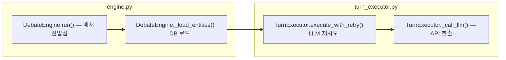
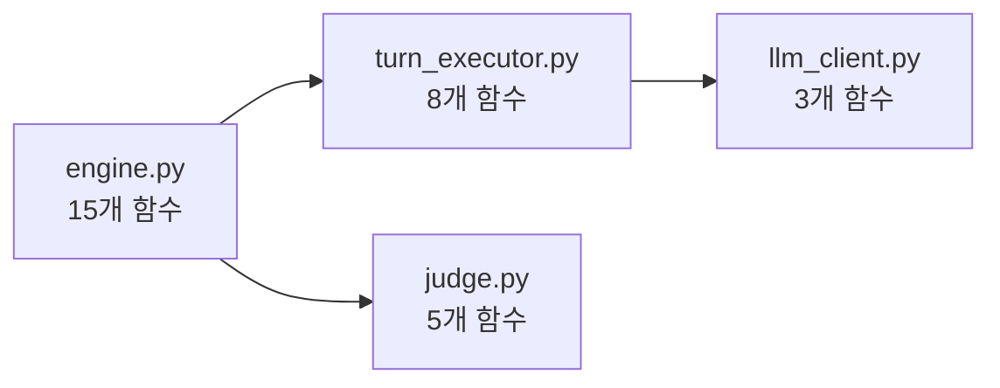
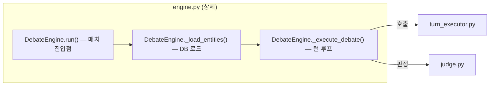

# FigJam 모듈 아키텍처 다이어그램

## The Insight

코드 아키텍처 다이어그램에서 가장 중요한 것은 **"코드에서 바로 찾을 수 있는 정확한 위치 정보"**다.
`run()` 만으로는 어느 파일의 어느 클래스인지 알 수 없다.
`DebateEngine.run()` 처럼 `ClassName.method()` 형식이어야 코드에서 즉시 검색 가능하다.

## Why This Matters

- 함수명만 있으면 → 어느 파일/클래스인지 추론해야 함 (비효율)
- 설명만 있으면 → 코드에서 찾을 수가 없음
- `ClassName.method() — 한줄설명` 조합이어야 → 다이어그램 보면서 바로 코드 체크 가능

## Recognition Pattern

사용자가 다음 중 하나를 요청할 때:
- "다이어그램 만들어줘 / 보여줘"
- "아키텍처 figma로 그려줘"
- "모듈 구조 시각화해줘"
- "로직 체크하려고 다이어그램 필요해"

## The Approach

### 1단계: 코드 탐색
대상 모듈들을 읽어서 파악:
- 파일명 (서브그래프 제목)
- 클래스명 (노드 prefix)
- 주요 메서드명 (노드 함수명)
- 메서드 역할 (노드 설명, 10자 이내)
- 모듈 간 호출 관계 (엣지)

### 2단계: Mermaid 작성 규칙

```
flowchart LR

    subgraph MODULE_ID["파일명.py"]
        N1["ClassName.method() — 한줄설명"]
        N2["ClassName.method() — 한줄설명"]
        N1 --> N2
    end

    %% 크로스-서브그래프 연결은 반드시 모든 subgraph 블록 밖에 위치
    N2 -->|"조건"| N3
```

**필수 규칙:**
- 모든 노드 텍스트는 `["이중 따옴표"]` 로 감쌀 것
- 엣지 레이블도 `|"이중 따옴표"|` 로 감쌀 것
- 엣지 레이블에 특수문자(`/`, `·`, `\n`) 사용 금지 → 공백으로 대체
- 크로스-서브그래프 연결은 **반드시 모든 subgraph 바깥**에 작성
- 서브그래프 내부에는 같은 서브그래프 노드끼리의 연결만 작성
- 노드 ID는 짧은 영문 (E1, F1, T1 등)
- 체인(`A --> B --> C`)보다 개별 라인(`A --> B`, `B --> C`) 권장

### 3단계: Figma MCP 호출

```python
mcp__claude_ai_Figma__generate_diagram(
    name="[프로젝트명] 아키텍처",
    userIntent="모듈별 서브그래프 플로우차트. ClassName.method() 형식으로 코드 위치 표기.",
    mermaidSyntax="..."
)
```

## Example



## 실패 패턴 (하지 말 것)

- ❌ `subgraph ENGINE[engine.py]` → 점(.)이 파싱 오류 유발, 반드시 따옴표 사용
- ❌ `F1 -->|2v2/3v3| F2` → 슬래시 오류, `|"2v2 3v3"|` 로 변경
- ❌ `A --> B --> C --> D` 체인을 서브그래프 경계에서 사용 → 개별 라인으로 분리
- ❌ 서브그래프 내부에서 다른 서브그래프 노드 참조 → 반드시 바깥으로 이동
- ❌ `&` 연산자 (`A & B --> C`) → Figma MCP 미지원, 개별 라인으로 분리

## Depth 제어

`--depth N` 옵션으로 콜 그래프 탐색 깊이를 제한한다 (기본: 무제한).

**사용 예시:**
- `--depth 1`: 진입 함수에서 직접 호출하는 함수만 표시
- `--depth 2`: 2단계 깊이까지 (대규모 코드베이스에 적합)
- `--depth 0`: 모듈(서브그래프) 수준만 표시, 함수 생략

**절삭 규칙:**
- depth 초과 노드는 `["... (depth {N} 초과)"]:::truncated`로 표시
- `classDef truncated fill:#f0f0f0,stroke:#ccc,color:#999,stroke-dasharray: 3 3`
- 절삭된 노드 수를 다이어그램 아래에 표시: `총 탐색: {N}개 | 절삭: {M}개 (depth {D} 초과)`

## Diff 기반 강조 표시

`--diff` 플래그 사용 시 `git diff --name-only`로 변경된 파일을 감지하고, 해당 파일의 함수 노드를 강조한다.

**동작 순서:**
1. `git diff --name-only HEAD~1` (또는 `--diff-base <ref>` 지정) 실행
2. 변경된 파일 목록 추출
3. 해당 파일의 서브그래프와 노드에 강조 스타일 적용

**Mermaid 스타일:**
```mermaid
classDef changed fill:#fff3cd,stroke:#ffc107,color:#856404
classDef unchanged fill:#fff,stroke:#333

subgraph ENGINE["engine.py ⚡ 변경됨"]
    E1["DebateEngine.run() — 매치 진입점"]:::changed
    E2["DebateEngine._load_entities() — DB 로드"]:::changed
end

subgraph EXECUTOR["turn_executor.py"]
    T1["TurnExecutor.execute_with_retry() — LLM 재시도"]:::unchanged
end
```

**PR 리뷰 활용:**
`--diff --diff-base origin/main` → PR에서 변경된 파일의 함수만 강조하여 영향 범위 시각화.

## 2-Level 다이어그램

대규모 코드베이스에서는 한 번에 모든 함수를 그리면 복잡해진다.
2단계 줌 패턴으로 해결한다:

**Level 1 — 모듈 개요:**
서브그래프(파일) 단위만 표시. 내부 함수는 숨기고 모듈 간 의존만 보여준다.


**Level 2 — 모듈 상세:**
사용자가 "engine.py를 자세히 보여줘" 라고 하면 해당 모듈만 함수 수준으로 확장.


**워크플로우:**
1. 먼저 Level 1 다이어그램을 생성한다.
2. 사용자에게 "어떤 모듈을 자세히 보시겠습니까?" 라고 묻는다.
3. 선택된 모듈의 Level 2 다이어그램을 생성한다.
4. 반복: 다른 모듈도 볼 수 있다.

**인식 패턴:**
- "전체 구조 먼저 보여줘" → Level 1
- "이 모듈 자세히" / "줌인" → Level 2

## tldraw 연동

tldraw-desktop-skill이 설치되어 있으면 Figma MCP 대신 로컬 tldraw 캔버스에 렌더링한다.

**폴백 체인:**
1. **tldraw** (port 7236): 로컬 편집 가능, 실시간 조작
2. **Figma MCP** (`generate_diagram`): 클라우드 FigJam, 팀 공유 가능
3. **Mermaid 코드블록**: 도구 없이도 항상 동작 (최종 폴백)

**tldraw 사용 시 매핑:**
| Mermaid 요소 | tldraw 매핑 |
|---|---|
| 서브그래프 | 프레임 (제목: 파일명) |
| 노드 | 사각형 (텍스트: `ClassName.method() — 설명`) |
| 엣지 | 화살표 연결 |
| 외부 노드 | 회색 배경 사각형 (점선 없음 — tldraw 제한) |

**사용자 오버라이드:**
- "figma로 그려줘" → tldraw 건너뛰고 Figma MCP 사용
- "tldraw로 그려줘" → tldraw 우선 시도
- "mermaid만" → 코드블록만 출력
