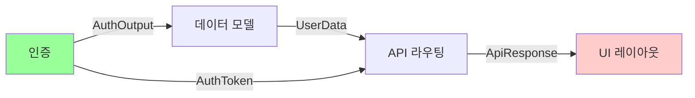
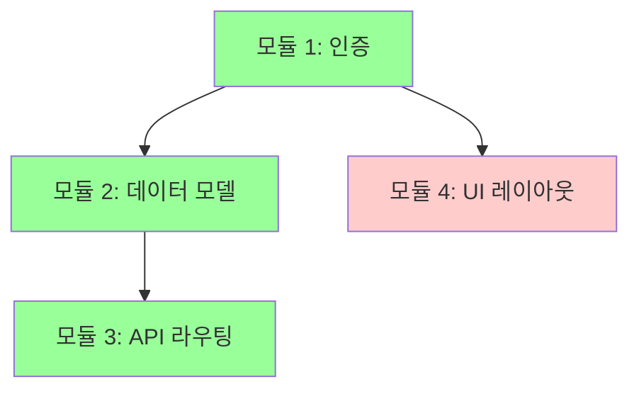

<Purpose>
Plan Interview는 "어떻게 만들지"를 모듈 단위로 설계하고, 개발자가 모든 설계 결정을 납득한 뒤에만 실행으로 넘어가는 인터뷰 스킬이다. deep-interview가 "무엇을 만들지"를 정제하는 요구사항 인터뷰라면, plan-interview는 확정된 spec 또는 명확한 기능 요청을 받아 "어떻게 만들지" 설계를 모듈별로 확인시킨다.

핵심 메커니즘:
1. 프로젝트를 3~7개 논리 모듈로 분해한다.
2. 각 모듈에 복잡도(LOW/MEDIUM/HIGH)를 부여하고 복잡도에 따라 Q&A 깊이를 조절한다.
3. 모듈마다 하드 블락을 건다 -- 개발자가 "납득했습니다"라고 응답하기 전에는 절대 다음 모듈로 넘어가지 않는다.
4. "건너뛰기", "나중에", "스킵" 옵션은 존재하지 않는다.
5. 모든 모듈이 CONFIRMED되면 `.omc/plans/`에 실행 가능한 계획 문서를 생성한다.

출력: `.omc/plans/plan-interview-{slug}.md`
</Purpose>

<Use_When>
- deep-interview로 spec을 만든 후, 구현 설계를 확인할 때
- 이미 무엇을 만들지 알고, "어떻게 만들지" 설계를 확인하고 싶을 때
- "plan interview", "설계 인터뷰", "모듈별 설계", "설계를 납득하고 싶다" 같은 요청이 들어올 때
- 새 프로젝트 또는 대규모 기능 추가 전에 아키텍처를 모듈 단위로 점검할 때
- 코드 어시스턴트가 생성한 설계를 이해하지 못하고 넘기는 상황을 방지하고 싶을 때
</Use_When>

<Do_Not_Use_When>
- 무엇을 만들지 아직 모호할 때 -- deep-interview를 먼저 실행하세요
- 설계가 이미 납득되어 계획 문서만 필요할 때 -- omc-plan을 사용하세요
- 단순 버그 수정이나 1~2줄 변경 -- executor 또는 ralph로 직접 실행하세요
- 기존 코드의 리팩토링 -- refactor-interview를 사용하세요
- 사용자가 "그냥 해줘", "질문 없이 진행해" 라고 명시한 경우 -- 의사를 존중하세요
</Do_Not_Use_When>

<Why_This_Exists>
AI 코드 어시스턴트는 설계를 즉시 생성할 수 있다. 문제는 개발자가 그 설계를 이해하지 못한 채 "좋아 보이네요"라고 넘기는 것이다. 나중에 "이 코드 왜 이렇게 돼 있지?"라는 질문이 되돌아온다.

Plan Interview는 이 문제를 구조적으로 해결한다:
- 전체를 한 번에 설명하는 대신, 모듈 단위로 쪼개서 하나씩 납득시킨다.
- 납득 전에는 물리적으로 다음 단계로 진행할 수 없다 (하드 블락).
- 복잡도에 따라 질문 깊이를 자동 조절하여 단순한 모듈에 시간을 낭비하지 않는다.
- 라운드 캡으로 무한 루프를 방지하면서도, 강제 진행된 모듈은 위험 플래그를 남긴다.

deep-interview와의 관계:
```
deep-interview (What to build)  -->  plan-interview (How to build)  -->  실행 (ralph/team/autopilot)
     요구사항 정제                         설계 납득                          코드 생성
     Ambiguity scoring                  모듈별 하드 블락                    계획 기반 실행
     출력: spec.md                      출력: plan.md                     출력: working code
```
</Why_This_Exists>

<Execution_Policy>
- 한 번에 하나의 모듈만 다룬다 -- 여러 모듈을 동시에 설명하지 않는다
- 개발자에게는 판단과 선호만 묻는다 -- 코드베이스 사실은 도구로 먼저 확인한다
- 모듈 납득 없이 다음 모듈로 진행하지 않는다 (하드 블락)
- "건너뛰기" 옵션은 절대 제공하지 않는다
- 복잡도에 맞게 Q&A 깊이를 조절한다 (LOW는 간략, HIGH는 심층)
- 라운드 캡을 준수한다 -- soft cap에서 경고, hard cap에서 강제 진행 + 위험 표시
- 대화 중에는 텍스트 진행 표시기를 사용한다 -- Mermaid는 최종 계획 문서에만 포함한다
- 인터뷰 상태를 `state_write`로 저장하여 세션 중단/재개를 지원한다
- 백트래킹(이전 모듈로 복귀)을 허용하되, 이후 모듈의 CONFIRMED 상태를 리셋한다
</Execution_Policy>

<Steps>

## Phase 1: 프로젝트 스코핑 (Project Scoping)

**목적:** 프로젝트의 전체 범위를 파악하고 모듈 목록을 도출한다.

### Step 1-1: 입력 파싱 및 세션 확인

1. `{{ARGUMENTS}}`에서 프로젝트 설명을 파싱한다.
2. `{{ARGUMENTS}}`가 비어 있으면: `AskUserQuestion`으로 프로젝트 설명을 요청한다.
   - "어떤 프로젝트/기능의 설계를 인터뷰하시겠습니까? (deep-interview spec 파일 경로도 가능합니다)"
3. `state_read`로 기존 세션을 확인한다.
   - 진행 중인 인터뷰가 있으면 `AskUserQuestion`으로 재개 여부를 묻는다:
     - "이전 인터뷰를 이어서 진행할까요?" → Phase 복원, 마지막 ACTIVE 모듈부터 재개
     - "새로 시작할까요?" → 기존 상태 초기화, Phase 1부터 시작

### Step 1-2: 코드베이스 탐색 (Brownfield 감지)

1. Glob/Grep/Read로 기존 코드베이스 구조를 파악한다.
   - 소스 파일 존재 여부, 디렉토리 구조, 주요 패턴
2. 프로젝트가 기존 코드 위에 구축되는 경우 (brownfield): 관련 코드 영역을 사전 매핑한다.
3. 완전히 새로운 프로젝트인 경우 (greenfield): 기술 스택과 제약 조건을 정리한다.

### Step 1-3: 모듈 분해 및 복잡도 부여

1. 프로젝트를 **3~7개의 논리적 모듈**로 분해한다.
   - 모듈 분해 기준: 독립적으로 설계 결정을 내릴 수 있는 단위
   - 예시: 인증, 데이터 모델, API 라우팅, UI 레이아웃, 상태 관리, 비즈니스 로직 등
2. 각 모듈에 **복잡도 레벨**을 부여한다:

| 복잡도 | 기준 | Q&A 깊이 |
|--------|------|----------|
| **LOW** | 단순 CRUD, 데이터 전달만 하는 모듈 | 간략 확인 (1~2 라운드) |
| **MEDIUM** | 상태 관리, 중간 로직이 있는 모듈 | 표준 Q&A (최대 5 라운드) |
| **HIGH** | 인증, 동시성, 복잡 비즈니스 로직 | 심층 Q&A (최대 10 라운드) |

3. 사용자가 복잡도를 조정할 수 있다:
   - "이 모듈은 더 자세히 설명해주세요" → 복잡도 한 단계 상승 (라운드 캡 확대)
   - "이 모듈은 간단히 넘어가도 됩니다" → 복잡도 한 단계 하강 (라운드 캡 축소)

### Step 1-4: 초기 상태 저장 및 확인

1. 초기 진행 표시기를 생성한다:

```
진행 상황:
[ ] 모듈 1: 인증 [HIGH]
[ ] 모듈 2: 데이터 모델 [MEDIUM]
[ ] 모듈 3: API 라우팅 [LOW]
[ ] 모듈 4: UI 레이아웃 [MEDIUM]
```

2. `state_write`로 인터뷰 상태를 저장한다:

```json
{
  "active": true,
  "current_phase": "plan-interview",
  "state": {
    "interview_id": "<uuid>",
    "project_description": "<입력>",
    "type": "greenfield|brownfield",
    "modules": [
      { "name": "인증", "complexity": "HIGH", "status": "PENDING", "round": 0, "design": null }
    ],
    "current_module_index": 0,
    "interview_log": [],
    "backtrack_history": []
  }
}
```

3. `AskUserQuestion`으로 모듈 목록과 복잡도를 확인받는다:
   - "이 모듈 분해가 맞나요?"
   - "모듈을 추가하거나 합치고 싶어요"
   - "다시 분석해주세요"

---

## Phase 2: 모듈별 설계 Q&A 루프 (Module Design Interview Loop)

**목적:** 각 모듈에 대해 설계를 제시하고, 개발자가 납득할 때까지 Q&A를 반복한다.

### Step 2-0b: 템플릿 모듈 감지

모듈이 알려진 패턴과 일치하는지 확인한다:

| 패턴 | 감지 조건 | 템플릿 Q&A |
|------|-----------|------------|
| 표준 CRUD API | 이름에 "API", "CRUD", "라우팅" 포함 | 엔드포인트 목록, 인증 여부만 확인 |
| 인증/JWT | 이름에 "인증", "auth", "로그인" 포함 | JWT vs 세션, 토큰 갱신 방식만 확인 |
| 상태관리 | 이름에 "상태", "store", "Redux" 포함 | 전역 vs 로컬, persist 여부만 확인 |
| DB 마이그레이션 | 이름에 "DB", "마이그레이션", "스키마" 포함 | ORM 선택, 마이그레이션 도구만 확인 |

패턴 매칭 시:
```
이 모듈은 [표준 CRUD API] 패턴으로 보입니다.
템플릿 기반으로 빠르게 확인하시겠습니까? (표준 패턴에서 벗어나는 부분만 질문)
아니면 처음부터 설계하시겠습니까?
```

템플릿 모드: 표준 패턴의 기본값을 제시하고, 사용자는 변경이 필요한 부분만 지적. 라운드 수 대폭 단축.

### Step 2-1: 모듈 설계 초안 제시

현재 모듈의 설계 초안을 제시한다:

1. **모듈의 책임 범위** -- 이 모듈이 담당하는 기능과 경계
2. **핵심 데이터 구조 / 인터페이스** -- 주요 타입, 함수 시그니처, API 등
3. **다른 모듈과의 의존 관계** -- 입력/출력 관계, 호출 방향
4. **인터페이스 계약** -- 이 모듈의 input/output을 TypeScript 타입 또는 JSON Schema로 정의:
   ```typescript
   // 인증 모듈 인터페이스 예시
   interface AuthInput { email: string; password: string; }
   interface AuthOutput { token: string; user: User; expiresAt: Date; }
   ```

복잡도별 설명 깊이:
- **LOW:** 핵심 결정 1~2개만 간략 확인 ("이 모듈은 단순 CRUD입니다. 이 데이터 구조로 진행할까요?")
- **MEDIUM:** 설계 대안 비교 + 의존 관계 확인 (표준 수준의 Q&A)
- **HIGH:** 엣지 케이스, 동시성, 보안, 실패 시나리오까지 심층 확인

### Step 2-2: 설계 대안 비교 (해당 시)

설계 대안이 2개 이상인 경우 A vs B 형태로 제시한다:

```
대안 A: JWT 기반 무상태 인증
  장점: 서버 부하 낮음, 수평 확장 용이
  단점: 토큰 무효화 어려움, 토큰 크기

대안 B: 세션 기반 인증 + Redis
  장점: 즉시 무효화 가능, 토큰 크기 작음
  단점: Redis 의존성, 서버 상태 유지

추천: 대안 A (이유: 프로토타입 단계에서 인프라 복잡도를 낮추기 위함)
```

### Step 2-3: 하드 블락 납득 확인

각 모듈의 Q&A가 끝나면 `AskUserQuestion`으로 납득을 확인한다.

**AskUserQuestion 질문 형식:**
```
모듈 "{module_name}" 설계를 이해하셨나요? [복잡도: {LOW|MEDIUM|HIGH}, 라운드: {n}/{max}]
```

**선택지 (5개 고정, "건너뛰기" 절대 없음):**

1. **"납득했습니다. 다음 모듈로 진행해주세요."**
   → 모듈 상태: ACTIVE → CONFIRMED
   → 진행 표시기에서 `[▶]` → `[✓]`로 전환
   → 다음 모듈로 이동

2. **"아직 이해가 안 됩니다. {구체적 질문}"**
   → 해당 부분을 더 상세히 설명
   → 동일 모듈에서 Q&A 계속 (라운드 +1)

3. **"대안을 다시 비교해주세요."**
   → 설계 대안 A vs B를 다시 제시하거나 새로운 대안 C를 추가
   → 동일 모듈에서 Q&A 계속 (라운드 +1)

4. **"설계를 수정해주세요: {변경 요청}"**
   → 개발자의 요청을 반영하여 설계 수정
   → 수정된 설계를 다시 제시 후 납득 확인 (라운드 +1)

5. **"이전 모듈 [{name}]으로 돌아가서 결정을 수정하고 싶습니다."**
   → 백트래킹 실행 (Step 2-5 참조)

### Step 2-4: 라운드 캡 규칙

| 복잡도 | soft cap (경고) | hard cap (강제 진행) |
|--------|-----------------|---------------------|
| LOW    | 2 라운드        | 4 라운드            |
| MEDIUM | 5 라운드        | 8 라운드            |
| HIGH   | 7 라운드        | 10 라운드           |

**soft cap 도달 시:**
경고 메시지를 출력하되 Q&A는 계속한다:
```
같은 모듈에서 {n}번 설명했습니다. 다른 접근으로 설명할까요, 아니면 구체적으로 어떤 부분이 막히시나요?
```

**hard cap 도달 시:**
강제 진행 + 위험 표시:
```
이 모듈은 {n}라운드 동안 납득되지 않았습니다.
위험 플래그를 표시하고 다음 모듈로 진행합니다.
최종 계획 문서에 이 모듈이 미납득 상태로 표시됩니다.
```
→ 모듈 상태: ACTIVE → FORCED
→ 진행 표시기에서 `[▶]` → `[!]`로 전환
→ 인터뷰 로그에 미납득 강제 진행 사실 기록
→ 다음 모듈로 이동

### Step 2-5: 백트래킹 메커니즘

사용자가 "이전 모듈로 돌아가기"를 선택한 경우:

1. **지정한 모듈의 상태 전이:** CONFIRMED → ACTIVE (`[✓]` → `[▶]`)
2. **그 이후 CONFIRMED된 모듈들의 상태 전이:** CONFIRMED → PENDING (`[✓]` → `[ ]`)
   - 이유: 이전 결정에 의존하는 설계가 무효화될 수 있으므로
3. **인터뷰 로그에 기록:**
   - 백트래킹 사유
   - 영향받은 모듈 목록
   - 리셋된 모듈 상태

예시:
```
백트래킹 전:
[✓] 모듈 1: 인증 [HIGH] (납득 완료, 3라운드)
[✓] 모듈 2: 데이터 모델 [MEDIUM] (납득 완료, 2라운드)
[▶] 모듈 3: API 라우팅 [LOW] (Q&A 진행 중, 라운드 1/2)

사용자: "이전 모듈 [인증]으로 돌아가서 결정을 수정하고 싶습니다."

백트래킹 후:
[▶] 모듈 1: 인증 [HIGH] (재진입, 라운드 4)
[ ] 모듈 2: 데이터 모델 [MEDIUM] (리셋됨 -- 인증 결정에 의존)
[ ] 모듈 3: API 라우팅 [LOW] (리셋됨)
```

### Step 2-6: 진행 표시기 업데이트

모듈 상태가 변경될 때마다 텍스트 진행 표시기를 출력한다:

```
진행 상황:
[✓] 모듈 1: 인증 [HIGH] (납득 완료, 3라운드)
[▶] 모듈 2: 데이터 모델 [MEDIUM] (Q&A 진행 중, 라운드 2/5)
[ ] 모듈 3: API 라우팅 [LOW]
[ ] 모듈 4: UI 레이아웃 [MEDIUM]
```

기호 규칙:
| 기호 | 상태 | 의미 |
|------|------|------|
| `[✓]` | CONFIRMED | 납득 완료 |
| `[▶]` | ACTIVE | 현재 Q&A 진행 중 |
| `[ ]` | PENDING | 대기 중 |
| `[!]` | FORCED | 위험 -- hard cap으로 강제 진행됨 |

### Step 2-7: 상태 저장

모듈 상태가 변경될 때마다 `state_write`로 저장한다:
- 현재 Phase, 모듈 목록 + 각 상태, 복잡도 + 현재 라운드, 인터뷰 로그, 백트래킹 이력

---

## Phase 3: 통합 설계 검증 (Integration Verification)

**목적:** 모든 모듈이 개별적으로 납득/강제 진행되었으므로, 모듈 간 통합 지점을 검증한다.

### Step 3-0: 모듈 의존 그래프 시각화

모듈 간 의존 관계를 Mermaid 다이어그램으로 시각화한다:



**위상 정렬 기반 구현 순서:**
의존 관계를 분석하여 안전한 구현 순서를 자동 제안한다:
```
권장 구현 순서 (위상 정렬):
1. 인증 — 의존 없음
2. 데이터 모델 — 인증에 의존
3. API 라우팅 — 인증, 데이터 모델에 의존
4. UI 레이아웃 — API 라우팅에 의존
```

순환 의존 감지 시 경고하고 해결 방안을 제시한다.

**인터페이스 호환성 검증:**
연결된 모듈 간 output → input 타입이 호환되는지 확인한다:
```
인터페이스 호환성:
  인증.AuthOutput → 데이터모델.input: ✓ 호환
  API라우팅.ApiResponse → UI.input: ⚠️ 불일치 — pagination 필드 누락
```

### Step 3-1: 통합 지점 분석

1. 모듈 간 의존 관계를 종합적으로 정리한다:
   - 어떤 모듈이 어떤 모듈의 출력에 의존하는가
   - 데이터 흐름 방향
   - 공유 자원 (DB 테이블, API 엔드포인트, 상태 등)

2. 통합 시 발생할 수 있는 충돌이나 불일치를 짚는다:
   - 인터페이스 불일치 (타입, 포맷)
   - 순환 의존
   - 동시성 문제

### Step 3-2: 통합 설계 납득 확인

`AskUserQuestion`으로 전체 통합 설계를 확인한다:
- "전체 모듈 간 통합 설계를 이해하셨나요?"
- "통합 지점에 대해 추가 질문이 있나요?"
- "통합 설계를 수정해주세요: {변경 요청}"

---

## Phase 4: 계획 문서 생성 (Plan Document Generation)

**목적:** `.omc/plans/` 아래에 실행 가능한 계획 문서를 생성한다.

### Step 4-1: 계획 문서 구성

납득된 모든 모듈 설계를 종합하여 다음 구조의 문서를 생성한다:

```markdown
# {프로젝트명} 설계 계획서

## 메타데이터
- 인터뷰 일시: {date}
- 모듈 수: {count}
- 모든 모듈 납득 완료: {Yes | No (위험 모듈 N개)}
- 총 Q&A 라운드: {total_rounds}

## 아키텍처 다이어그램

(최종 Mermaid 다이어그램 -- graph TB 형식)

{각 모듈 노드 + 의존 관계 화살표}
{색상: 초록(#9f9) = CONFIRMED, 빨강(#fcc) = FORCED}

## 모듈별 설계

### 모듈 1: {name} [{complexity}] -- {CONFIRMED | FORCED}
- **책임:** ...
- **핵심 데이터 구조:** ...
- **의존 관계:** ...
- **핵심 결정:** ... (선택한 대안과 이유)
- **수용 기준:**
  - [ ] {testable criterion 1}
  - [ ] {testable criterion 2}
{FORCED인 경우:}
- **미납득 경고:** 이 모듈은 {n}라운드 후 강제 진행되었습니다. 실행 전 추가 확인을 권장합니다.

## 인터페이스 계약

| 모듈 | Input Interface | Output Interface | 연결 대상 |
|------|----------------|-----------------|-----------|
| {name} | `{InputType}` | `{OutputType}` | {consumer 모듈} |

## 복잡도 추적

| 모듈 | 예상 라운드 | 실제 라운드 | 예상 난이도 | 실제 난이도 |
|------|-------------|-------------|-------------|-------------|
| {name} | {n} | _(구현 후 기입)_ | {LOW/MED/HIGH} | _(구현 후 기입)_ |

## 구현 순서

의존 관계 기반 위상 정렬:
1. {모듈 X} -- 의존 없음
2. {모듈 Y} -- X에 의존
...

## 인터뷰 로그
<details><summary>전체 Q&A 기록 ({total_rounds} 라운드)</summary>

### 모듈: {name} [{complexity}]
**라운드 1:**
- 설명: ...
- 개발자 응답: ...
- 결과: 추가 설명 요청

**라운드 2:**
- 설명: ...
- 개발자 응답: "납득했습니다"
- 결과: CONFIRMED

{백트래킹 발생 시:}
**백트래킹 기록:**
- 사유: ...
- 영향받은 모듈: ...
- 리셋된 모듈 상태: ...

{강제 진행 발생 시:}
**강제 진행 기록:**
- hard cap 도달 라운드: {n}
- 미납득 사유 요약: ...
</details>
```

### Step 4-2: FORCED 모듈 처리

FORCED(강제 진행) 모듈이 하나라도 있는 경우:
- 메타데이터의 "모든 모듈 납득 완료" 항목을 `No (위험 모듈 N개)`로 표기한다.
- 해당 모듈 섹션에 미납득 경고를 추가한다.
- Mermaid 다이어그램에서 해당 노드를 빨간색(`fill:#fcc`)으로 표시한다.

### Step 4-3: Mermaid 다이어그램 생성

최종 계획 문서에만 Mermaid 다이어그램을 포함한다 (대화 중에는 텍스트 진행 표시기 사용):



색상 규칙 (최종 문서용):
| 상태 | 색상 | 의미 |
|------|------|------|
| `fill:#9f9` | 초록 | 납득 완료 (CONFIRMED) |
| `fill:#fcc` | 연한 빨강 | 위험/강제 진행 (FORCED) |

### Step 4-4: 파일 출력

`Write` 도구로 `.omc/plans/plan-interview-{slug}.md`에 계획 문서를 저장한다.
- `{slug}`는 프로젝트명을 kebab-case로 변환한 것 (예: `user-auth-system`)

---

## Phase 5: 실행 핸드오프 (Execution Handoff)

**목적:** 계획 완료 후 실행 모드를 선택한다.

### Step 5-1: 실행 옵션 제시

`AskUserQuestion`으로 실행 방법을 선택받는다:

1. **"ralph로 실행"**
   → `Skill("oh-my-claudecode:ralph")` 호출, 계획 파일 경로를 전달
   → 순차적 구현, architect 검증 포함

2. **"team으로 병렬 실행"**
   → `Skill("oh-my-claudecode:team")` 호출, 계획 파일 경로를 전달
   → N개 에이전트 병렬 구현, 대규모 계획에 적합

3. **"autopilot으로 실행"**
   → `Skill("oh-my-claudecode:autopilot")` 호출, 계획 파일 경로를 전달
   → 자율 파이프라인 실행 (Planning → Execution → QA → Validation)

4. **"계획만 저장 (실행 보류)"**
   → 계획 파일 경로를 출력하고 종료
   → "계획 문서가 {path}에 저장되었습니다. 나중에 이 파일로 실행할 수 있습니다."

**IMPORTANT:** 실행 옵션 선택 시 반드시 `Skill()`로 해당 스킬을 호출한다. plan-interview는 설계 인터뷰 에이전트이지 실행 에이전트가 아니다.

</Steps>

<Tool_Usage>
- **AskUserQuestion**: 모든 납득 확인 및 설계 선택에 사용. 하드 블락의 핵심 도구. 한 번에 하나의 질문만 던진다.
- **Glob**: 코드베이스 파일 구조 탐색 (brownfield 감지 시)
- **Grep**: 패턴 검색 -- import 관계, 클래스/함수 정의, 기존 구현 확인
- **Read**: 기존 코드 내용 확인 -- 개발자에게 묻기 전에 코드베이스 사실을 먼저 파악
- **Write**: 최종 계획 문서를 `.omc/plans/`에 저장
- **state_write / state_read**: 인터뷰 상태 저장/복원 -- 세션 중단/재개 지원
- **Skill()**: 실행 핸드오프 시 ralph/team/autopilot 호출

코드베이스 탐색 원칙:
- 개발자에게 묻기 전에 도구로 확인할 수 있는 사실은 반드시 먼저 확인한다
- "이 프로젝트에서 어떤 DB를 쓰시나요?"처럼 코드가 이미 답하는 질문을 하지 않는다
- 사실 확인 결과를 바탕으로 판단과 선호만 묻는다
</Tool_Usage>

<Examples>

<Good>
복잡도에 따른 Q&A 깊이 조절:
```
모듈: "API 라우팅" [LOW], 라운드 1/2

이 모듈은 단순한 RESTful 라우팅입니다.

엔드포인트 목록:
- GET /users, POST /users, GET /users/:id, PUT /users/:id, DELETE /users/:id
- GET /posts, POST /posts, GET /posts/:id

모든 엔드포인트가 표준 CRUD 패턴을 따릅니다.
이 구조로 진행할까요?
```
Why good: LOW 복잡도 모듈이므로 핵심만 간략히 확인하고 시간을 아낀다.
</Good>

<Good>
코드베이스 사실을 먼저 확인한 후 질문:
```
[Grep으로 기존 인증 구현 확인: "src/auth/에서 JWT + passport.js 사용 중"]

모듈: "인증" [HIGH], 라운드 1/7

현재 프로젝트에서 JWT + passport.js 기반 인증을 사용하고 계십니다 (src/auth/).
새 기능에서 이 인증을 확장할지, 별도 인증 흐름을 추가할지 결정이 필요합니다.

대안 A: 기존 passport.js 미들웨어 확장
  장점: 일관성, 기존 코드 재사용
  단점: passport 전략 수가 늘어남

대안 B: 별도 인증 흐름 (API 키 기반)
  장점: API 전용 인증 분리, 간단한 구현
  단점: 두 인증 시스템 유지 부담

추천: 대안 A (이유: 프로토타입 단계에서 인증 시스템 이원화는 불필요)
```
Why good: 코드베이스에서 이미 알 수 있는 사실(JWT, passport)을 먼저 확인하고, 개발자에게는 판단만 요청한다.
</Good>

<Good>
백트래킹이 발생한 경우의 진행 표시기:
```
[백트래킹 발생: 모듈 3에서 모듈 1로 복귀 요청]
사유: "인증 방식을 세션 기반으로 바꾸면 데이터 모델도 변경 필요"

진행 상황:
[▶] 모듈 1: 인증 [HIGH] (재진입, 라운드 4)
[ ] 모듈 2: 데이터 모델 [MEDIUM] (리셋됨)
[ ] 모듈 3: API 라우팅 [LOW] (리셋됨)
[ ] 모듈 4: UI 레이아웃 [MEDIUM]

모듈 2, 3이 리셋되었습니다 -- 인증 결정이 변경되면 이 모듈들의 설계도 재확인이 필요합니다.
```
Why good: 백트래킹 시 이후 모듈을 PENDING으로 리셋하고, 사유와 영향을 명확히 보여준다.
</Good>

<Bad>
여러 모듈을 한 번에 설명:
```
모듈 1~4의 설계를 한꺼번에 정리했습니다:
- 인증: JWT 사용
- 데이터 모델: PostgreSQL + Prisma
- API: RESTful
- UI: React + TailwindCSS
모두 이해하셨나요?
```
Why bad: 4개 모듈을 한 번에 설명하면 개발자가 각각을 제대로 납득했는지 확인할 수 없다. 반드시 한 번에 하나의 모듈만 다룬다.
</Bad>

<Bad>
건너뛰기 옵션을 포함:
```
모듈 "인증" 설계를 이해하셨나요?
1. 납득했습니다.
2. 아직 이해가 안 됩니다.
3. 이 모듈은 나중에 보겠습니다.  <-- 절대 금지
4. 건너뛰기  <-- 절대 금지
```
Why bad: "나중에"나 "건너뛰기" 옵션은 납득 없는 진행을 허용한다. 이런 선택지는 절대 존재하지 않는다.
</Bad>

<Bad>
라운드 캡 없이 무한 루프:
```
모듈 "인증"에서 15라운드째 Q&A를 진행 중입니다...
(경고도, 강제 진행도 없이 계속)
```
Why bad: HIGH 복잡도의 hard cap은 10라운드이다. 캡을 초과하면 위험 표시 후 강제 진행해야 한다. 무한 루프는 사용자 시간을 낭비한다.
</Bad>

</Examples>

<Escalation_And_Stop_Conditions>

### 라운드 캡 (모듈당)

| 복잡도 | soft cap (경고) | hard cap (강제 진행) |
|--------|-----------------|---------------------|
| LOW    | 2 라운드        | 4 라운드            |
| MEDIUM | 5 라운드        | 8 라운드            |
| HIGH   | 7 라운드        | 10 라운드           |

- **soft cap 도달:** 경고 메시지 출력 -- "같은 모듈에서 {n}번 설명했습니다. 다른 접근으로 설명할까요?"
- **hard cap 도달:** 강제 진행 + 위험 표시(`[!]`) -- 인터뷰 로그에 미납득 강제 진행 사실 기록

### 전체 인터뷰 제한

- **모듈 10개 초과:** 경고 -- "모듈이 10개를 초과했습니다. 일부 모듈을 합치거나 범위를 줄이는 것을 권장합니다."
- **전체 라운드 합계 40 초과:** 경고 -- "총 Q&A가 40라운드를 넘었습니다. 남은 모듈의 복잡도를 한 단계 낮추겠습니다."

### 중단 조건

- **사용자가 "중단", "취소", "그만"이라고 말한 경우:** 즉시 중단, 현재 상태를 `state_write`로 저장. 나중에 재개 가능.
- **사용자가 "그냥 실행해"라고 말한 경우:** 현재까지 CONFIRMED된 모듈로만 계획 문서를 생성하고, PENDING 모듈은 미포함 경고와 함께 Phase 4로 진행.

### 세션 재개

- `/plan-interview`를 다시 호출하면 `state_read`로 이전 상태를 확인한다.
- 이전 세션이 있으면 재개 여부를 묻고, 마지막 ACTIVE 모듈부터 Q&A를 재개한다.
- 진행 표시기를 먼저 출력하여 현재 위치를 확인시킨다.

</Escalation_And_Stop_Conditions>

<Final_Checklist>
- [ ] 모든 모듈이 CONFIRMED 또는 FORCED 상태인가
- [ ] FORCED 모듈이 있다면 계획 문서에 "모든 모듈 납득 완료: No (위험 모듈 N개)"로 표기했는가
- [ ] 계획 문서가 `.omc/plans/plan-interview-{slug}.md`에 생성되었는가
- [ ] 계획 문서에 모듈별 설계, 구현 순서, 수용 기준이 포함되었는가
- [ ] 계획 문서에 최종 Mermaid 다이어그램이 포함되었는가 (FORCED 모듈은 빨간색)
- [ ] 인터뷰 로그(전체 Q&A 기록)가 계획 문서에 포함되었는가
- [ ] 백트래킹 이력이 있다면 인터뷰 로그에 기록되었는가
- [ ] 실행 핸드오프에서 Skill()로 선택된 스킬을 호출했는가 (직접 실행 금지)
- [ ] 인터뷰 상태가 `state_write`로 저장되었는가
- [ ] 대화 중에 Mermaid를 출력하지 않고 텍스트 진행 표시기만 사용했는가
</Final_Checklist>

<Advanced>

## deep-interview와의 파이프라인

deep-interview의 출력(spec)을 plan-interview의 입력으로 사용할 수 있다:

```
/deep-interview "AI 토론 플랫폼"
  → spec.md 생성 (ambiguity <= 20%)
  → 사용자가 "설계 인터뷰로 진행" 선택

/plan-interview "spec.md 기반으로 설계"
  → spec의 요구사항을 모듈로 분해
  → 모듈별 설계 Q&A
  → plan.md 생성
  → 실행 핸드오프
```

## 세션 상태 구조

`state_write`/`state_read`로 저장하는 상태:

```json
{
  "active": true,
  "current_phase": "plan-interview",
  "state": {
    "interview_id": "<uuid>",
    "project_description": "<입력>",
    "type": "greenfield|brownfield",
    "current_phase_number": 2,
    "modules": [
      {
        "name": "인증",
        "complexity": "HIGH",
        "status": "CONFIRMED",
        "round": 3,
        "max_round_soft": 7,
        "max_round_hard": 10,
        "design": { "summary": "...", "decision": "...", "alternatives": [] }
      }
    ],
    "current_module_index": 1,
    "interview_log": [
      {
        "module": "인증",
        "round": 1,
        "complexity": "HIGH",
        "explanation": "...",
        "user_response": "아직 이해가 안 됩니다. JWT 무효화는 어떻게?",
        "result": "additional_explanation"
      }
    ],
    "backtrack_history": [
      {
        "from_module": "API 라우팅",
        "to_module": "인증",
        "reason": "인증 방식 변경으로 데이터 모델 재검토 필요",
        "affected_modules": ["데이터 모델", "API 라우팅"],
        "timestamp": "..."
      }
    ]
  }
}
```

## 복잡도 동적 조정

사용자가 Q&A 도중 복잡도 변경을 요청할 수 있다:
- "이 모듈은 더 자세히 설명해주세요" → 복잡도 한 단계 UP (라운드 캡 확대)
- "이 모듈은 간단히 넘어가도 됩니다" → 복잡도 한 단계 DOWN (라운드 캡 축소)

변경 시 soft/hard cap이 새 복잡도 기준으로 재계산되며, 현재 라운드 수는 유지된다.

</Advanced>

Task: {{ARGUMENTS}}
