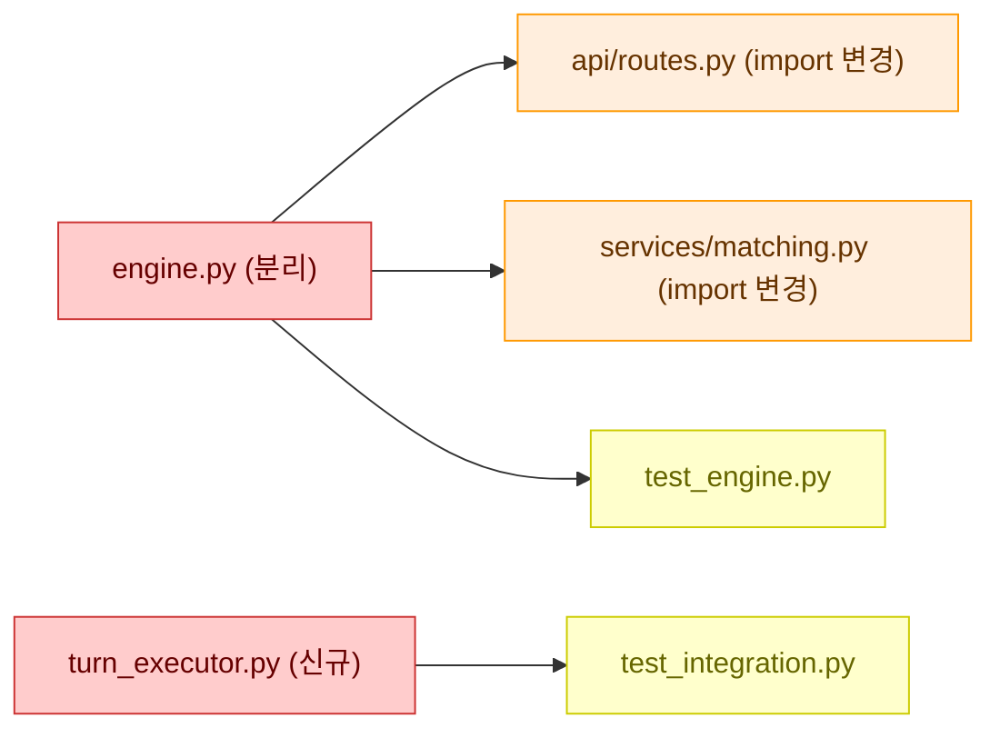
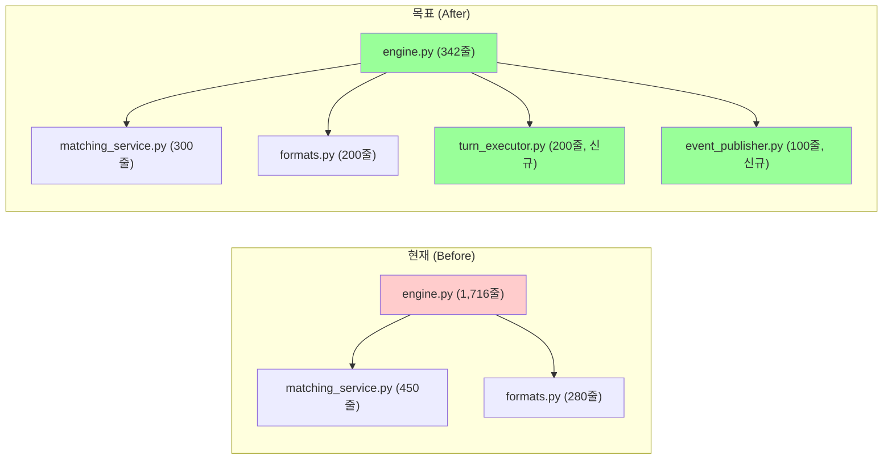

<Purpose>
Refactor Interview는 기존 코드를 자동 스캔하여 현황을 파악하고, 리팩토링 변경 사항을 모듈 단위로 설명하여 개발자가 모든 변경을 납득한 뒤에만 실행으로 넘어가는 인터뷰 스킬이다. plan-interview가 "새로 어떻게 만들지"를 납득시킨다면, refactor-interview는 "기존 코드를 왜/어떻게 바꾸는지"를 납득시킨다.

핵심 메커니즘:
1. 대상 코드를 Glob/Grep/Read로 자동 스캔하여 현황 리포트를 생성한다.
2. 리팩토링을 논리적 모듈(독립적으로 변경+테스트 가능한 단위)로 분해한다.
3. 각 모듈에 복잡도(LOW/MEDIUM/HIGH)를 부여하고 Before/After를 보여주며 Q&A한다.
4. 모듈마다 하드 블락을 건다 -- "납득했습니다" 전에는 절대 다음 모듈로 넘어가지 않는다.
5. "건너뛰기", "나중에", "스킵" 옵션은 존재하지 않는다.
6. 영향 범위 분석(테스트, 의존 관계, 롤백)까지 확인한 뒤 계획 문서를 생성한다.

출력: `.omc/plans/refactor-interview-{slug}.md`
</Purpose>

<Use_When>
- 기존 코드를 리팩토링하기 전에 변경 사항을 이해하고 싶을 때
- "refactor interview", "리팩토링 인터뷰", "코드 정리 전에 설명해줘" 같은 요청이 들어올 때
- 큰 파일을 분리하거나, 모듈 구조를 변경하거나, 인터페이스를 재설계할 때
- 리팩토링의 영향 범위를 파악하고 안전한 변경 순서를 확인하고 싶을 때
- 코드 어시스턴트가 제안한 리팩토링을 이해하지 못하고 넘기는 상황을 방지하고 싶을 때
</Use_When>

<Do_Not_Use_When>
- 리팩토링 범위가 명확하고 변경 사항을 이미 이해하고 있을 때 -- executor로 직접 실행하세요
- 단순 이름 변경이나 포맷팅 같은 기계적 변경 -- ast_grep_replace 또는 직접 실행하세요
- 새 기능을 설계할 때 -- plan-interview를 사용하세요
- 무엇을 만들지 아직 모호할 때 -- deep-interview를 먼저 실행하세요
- 사용자가 "그냥 리팩토링해줘", "질문 없이 진행해" 라고 명시한 경우 -- 의사를 존중하세요
</Do_Not_Use_When>

<Why_This_Exists>
AI 코드 어시스턴트는 리팩토링 계획을 즉시 만들 수 있다. 문제는 개발자가 "왜 이 코드가 이렇게 바뀌는지" 이해하지 못한 채 "좋아 보이네요"라고 넘기는 것이다. 나중에 의도치 않은 동작 변경이나 회귀 버그가 발생해도 원인을 추적할 수 없다.

Refactor Interview는 이 문제를 구조적으로 해결한다:
- 코드를 먼저 스캔하여 현황을 객관적으로 파악한다 (파일 크기, 함수 수, 코드 스멜, 의존 관계).
- 각 변경 모듈의 Before/After를 구체적으로 보여주고, 왜 이 변경이 필요한지 설명한다.
- 납득 전에는 물리적으로 다음 모듈로 진행할 수 없다 (하드 블락).
- 영향 범위를 분석하여 어떤 테스트가 깨질 수 있는지, 롤백 방법은 무엇인지 명시한다.

plan-interview와의 관계:
```
plan-interview  = 새 프로젝트/기능의 설계를 납득 (How to build)
refactor-interview = 기존 코드의 변경을 납득 (How to change)

둘 다 동일한 하드 블락 Q&A, 라운드 캡, 백트래킹, 진행 표시기 메커니즘을 사용한다.
```
</Why_This_Exists>

<Execution_Policy>
- 코드를 먼저 스캔한다 -- 개발자에게 묻기 전에 Glob/Grep/Read로 사실을 확인한다
- 한 번에 하나의 모듈만 다룬다 -- 여러 변경을 동시에 설명하지 않는다
- Before/After를 구체적으로 보여준다 -- `Read` 도구로 읽은 실제 코드 블록을 Before/After로 표시 (100줄 이상도 생략 없이 전체 표시)
- 모듈 납득 없이 다음 모듈로 진행하지 않는다 (하드 블락)
- "건너뛰기" 옵션은 절대 제공하지 않는다
- 복잡도에 맞게 Q&A 깊이를 조절한다 (LOW는 간략, HIGH는 심층)
- 라운드 캡을 준수한다 -- soft cap에서 경고, hard cap에서 강제 진행 + 위험 표시
- 대화 중에는 텍스트 진행 표시기를 사용한다 -- Mermaid(Before/After)는 최종 계획 문서에만 포함한다
- 인터뷰 상태를 `state_write`로 저장하여 세션 중단/재개를 지원한다
- 영향 범위(깨질 테스트, 의존 파일, 롤백 방법)를 반드시 분석한다
</Execution_Policy>

<Steps>

## Phase 1: 코드베이스 스캔 및 현황 파악 (Codebase Scan & Status Report)

**목적:** 리팩토링 대상 코드를 자동 스캔하여 현재 상태를 파악한다.

### Step 1-1: 입력 파싱 및 세션 확인

1. `{{ARGUMENTS}}`에서 리팩토링 대상을 파싱한다 (파일 경로, 모듈명, 또는 "전체").
2. `{{ARGUMENTS}}`가 비어 있으면: `AskUserQuestion`으로 리팩토링 대상을 요청한다.
   - "어떤 파일/모듈/디렉토리를 리팩토링하시겠습니까?"
3. `state_read`로 기존 세션을 확인한다.
   - 진행 중인 인터뷰가 있으면 `AskUserQuestion`으로 재개 여부를 묻는다:
     - "이전 리팩토링 인터뷰를 이어서 진행할까요?" → Phase 복원, 마지막 ACTIVE 모듈부터 재개
     - "새로 시작할까요?" → 기존 상태 초기화, Phase 1부터 시작

### Step 1-2: 코드 자동 스캔

Glob/Grep/Read로 대상 코드를 탐색한다:

1. **파일 구조 및 크기:**
   - Glob으로 대상 디렉토리의 파일 목록을 확인한다
   - 각 파일의 줄 수를 파악한다

2. **주요 클래스/함수 목록:**
   - Grep으로 `class`, `def`, `function`, `export` 등의 패턴을 검색한다
   - 파일별 주요 구성 요소를 정리한다

3. **의존 관계 분석:**
   - Grep으로 `import`, `from ... import`, `require` 패턴을 분석한다
   - 모듈 간 의존 그래프를 파악한다

4. **코드 스멜 감지:**
   - 큰 함수 (200줄 이상)
   - 중복 패턴 (유사한 코드 블록)
   - 깊은 중첩 (4단계 이상)
   - 과도한 파라미터 (5개 이상)
   - 신(God) 클래스/파일 (500줄 이상)

### Step 1-3: 현황 리포트 생성

스캔 결과를 정리하여 개발자에게 제시한다:

```
코드 현황 리포트:

대상 범위: {directory_or_file}
총 파일: {count}개
총 줄 수: {total_lines}줄

파일별 요약:
- engine.py: 1,716줄, 15개 함수, 3개 클래스
- matching_service.py: 450줄, 8개 함수
- formats.py: 280줄, 5개 함수

발견된 문제점:
1. engine.py가 1,716줄로 과대 (신 파일)
2. _execute_debate()와 _execute_multi()에 중복 로직 존재
3. error handling이 3단계 이상 중첩
4. matching_service.py와 engine.py 간 순환 의존 가능성

의존 관계:
- engine.py → matching_service.py, formats.py, finalizer.py
- matching_service.py → engine.py (순환?)
- formats.py → (독립)
```

### Step 1-4: 스캔 범위 확인

`AskUserQuestion`으로 스캔 범위를 확인받는다:
- "이 범위가 맞나요?"
- "범위를 넓히거나 좁혀주세요: {변경 요청}"
- "다시 스캔해주세요"

### Step 1-5: 초기 상태 저장

`state_write`로 인터뷰 상태를 저장한다:

```json
{
  "active": true,
  "current_phase": "refactor-interview",
  "state": {
    "interview_id": "<uuid>",
    "target": "<대상 경로>",
    "scan_result": {
      "files": [{"path": "...", "lines": 1716, "functions": 15, "classes": 3}],
      "issues": ["..."],
      "dependencies": [{"from": "...", "to": "..."}]
    },
    "modules": [],
    "current_module_index": 0,
    "interview_log": [],
    "backtrack_history": []
  }
}
```

---

## Phase 2: 리팩토링 모듈 분해 (Refactoring Module Decomposition)

**목적:** 리팩토링을 논리적 단위(모듈)로 분해하고, 각 모듈의 변경 범위를 정의한다.

### Step 2-1: 모듈 도출

코드 스캔 결과를 기반으로 리팩토링 모듈을 도출한다.

모듈 분해 기준: **독립적으로 리팩토링하고 테스트할 수 있는 단위.**

### Step 2-2: 변경 유형 분류

각 모듈의 변경 유형을 분류한다:

| 유형 | 설명 | 예시 |
|------|------|------|
| **추출 (Extract)** | 큰 함수/클래스에서 분리 | 1,700줄 파일 → 5개 모듈로 분리 |
| **이동 (Move)** | 책임 재배치 | 유틸리티 함수를 적절한 모듈로 이동 |
| **통합 (Merge)** | 중복 코드 합치기 | 2개의 유사한 함수를 하나로 통합 |
| **인터페이스 변경 (Interface)** | API 시그니처 수정 | 함수 파라미터 구조 변경 |
| **삭제 (Delete)** | dead code 제거 | 사용되지 않는 함수/클래스 삭제 |

### Step 2-3: 복잡도 부여

각 모듈에 복잡도 레벨을 부여한다:

| 복잡도 | 기준 | Q&A 깊이 |
|--------|------|----------|
| **LOW** | 단순 이름 변경, dead code 삭제, 포맷 정리 | 간략 확인 (1~2 라운드) |
| **MEDIUM** | 함수 추출, 책임 이동, 중복 통합 | 표준 Q&A (최대 5 라운드) |
| **HIGH** | 인터페이스 변경, 대규모 구조 변경, 아키텍처 재설계 | 심층 Q&A (최대 10 라운드) |

### Step 2-3b: 안전성 점수 산출 (Safety Score)

각 모듈에 대해 안전성 점수(0~10)를 자동으로 산출한다:

**산출 요소:**

| 요소 | 점수 | 측정 방법 |
|------|------|-----------|
| 테스트 커버리지 있음 | +3 | Grep으로 해당 모듈을 import하는 test 파일 존재 여부 |
| 참조 횟수 < 5 | +3 | Grep으로 모듈을 import하는 파일 수 |
| 참조 횟수 5~10 | +2 | |
| 참조 횟수 > 10 | +1 | 참조가 많을수록 변경 영향 범위가 넓어 위험 |
| 마지막 변경 > 30일 전 | +2 | `git log -1 --format=%ai -- {file}` |
| 마지막 변경 7~30일 전 | +1 | |
| 마지막 변경 < 7일 전 | +0 | 최근 변경된 코드는 아직 안정화되지 않았을 수 있음 |
| TODO/FIXME 포함 | -1 | Grep으로 해당 파일 내 TODO/FIXME 검색 |

**표시:**
```
진행 상황:
[ ] 모듈 1: engine.py 분리 [HIGH] (안전성: 3/10 ⚠️)
[ ] 모듈 2: 중복 로직 통합 [MEDIUM] (안전성: 8/10)
[ ] 모듈 3: dead code 삭제 [LOW] (안전성: 9/10)
```

**낮은 안전성 처리 (< 4):**
- CONFIRMED 전에 추가 확인을 강제한다:
  ```
  ⚠️ 이 모듈의 안전성 점수가 {score}/10으로 낮습니다.
  이유: 테스트 없음, 12개 파일에서 참조, 3일 전 변경됨
  그래도 이 변경을 진행하시겠습니까?
  ```

### Step 2-4: 초기 진행 표시기 및 확인

진행 표시기를 생성하고 `AskUserQuestion`으로 모듈 분해를 확인받는다:

```
진행 상황:
[ ] 모듈 1: engine.py 분리 [HIGH] (추출)
[ ] 모듈 2: 중복 로직 통합 [MEDIUM] (통합)
[ ] 모듈 3: dead code 삭제 [LOW] (삭제)
[ ] 모듈 4: 인터페이스 정리 [MEDIUM] (인터페이스 변경)
```

선택지:
- "이 모듈 분해가 맞나요?"
- "모듈을 추가하거나 합치고 싶어요"
- "다시 분석해주세요"

---

## Phase 3: 모듈별 변경 Q&A 루프 (Module Change Interview Loop)

**목적:** 각 모듈의 변경 사항을 상세히 설명하고, 개발자가 납득할 때까지 Q&A를 반복한다.

### Step 3-1: 변경 계획 제시

현재 모듈의 변경 계획을 구체적으로 제시한다:

1. **현재 코드의 문제점** -- 파일명, 줄 번호로 위치를 특정하고 문제를 설명한다:
   ```
   현재 문제: engine.py:342-485 -- _execute_debate() 함수가 143줄로 과대

   이 함수 안에 턴 루프, LLM 호출, 에러 핸들링, SSE 발행이 모두 섞여 있습니다.
   ```

2. **Before 코드 블록** -- `Read` 도구로 해당 함수/클래스 전체를 읽어 코드 블록으로 직접 표시한다:
   - 100줄 이상이어도 생략(`...`) 없이 전체 표시
   - 이름 변경처럼 Before = After인 경우는 코드 블록 생략 가능 (대신 "코드 내용 동일, 파일명만 변경"이라고 명시)

   ```python
   # Before: engine.py:342-485 (_execute_debate 전체 — Read 도구 결과)
   async def _execute_debate(self, match, agent_a, agent_b, ...):
       # ... Read 도구로 읽은 실제 전체 코드 ...
   ```

3. **After 코드 블록** -- 변경 후 모습을 Claude가 직접 작성하여 표시한다:
   - 신규 파일 생성인 경우: 신규 파일의 전체 내용을 표시
   - 기존 파일 수정인 경우: 변경 후 해당 함수/클래스 전체를 표시
   - 100줄 이상이어도 생략 없이 전체 표시

   ```python
   # After: turn_executor.py (신규) — 전체 내용
   class TurnExecutor:
       # ... 변경 후 전체 코드 ...
   ```

4. **Why** -- 왜 이 변경이 필요한지:
   ```
   이유: 단일 파일에 모든 로직이 있으면 테스트가 어렵고,
   한 기능 수정 시 관련 없는 코드에 영향을 줄 수 있습니다.
   각 책임을 분리하면 독립적으로 테스트하고 수정할 수 있습니다.
   ```

### Step 3-2: 설계 대안 비교 (해당 시)

변경 대안이 2개 이상인 경우 A vs B 형태로 제시한다:

```
대안 A: 함수 단위로 추출 (같은 디렉토리에 파일 분리)
  장점: 최소 변경, import 경로 단순
  단점: 파일이 많아져도 같은 폴더에 flat하게 존재

대안 B: 서브 패키지로 분리 (debate/ 디렉토리 생성)
  장점: 논리적 그룹핑, 확장성
  단점: import 경로 변경 필요, 기존 호출자 수정

추천: 대안 B (이유: 장기적 확장성이 더 중요)
```

### Step 3-3: 위험 요소 명시

각 모듈의 위험 요소를 투명하게 밝힌다:
- **깨질 수 있는 기존 동작:** "engine.py의 내부 상태 관리가 변경되므로 진행 중인 매치에 영향 가능"
- **영향받는 다른 모듈/테스트:** "test_debate_engine.py의 import 경로 변경 필요"
- **롤백 방법:** "git stash로 원래 engine.py 복원 가능"

### Step 3-4: 하드 블락 납득 확인

`AskUserQuestion`으로 납득을 확인한다.

**AskUserQuestion 질문 형식:**
```
모듈 "{module_name}" 변경 사항을 이해하셨나요? [복잡도: {LOW|MEDIUM|HIGH}, 라운드: {n}/{max}]
```

**선택지 (5개 고정, "건너뛰기" 절대 없음):**

1. **"납득했습니다. 다음 모듈로 진행해주세요."**
   → 모듈 상태: ACTIVE → CONFIRMED
   → 진행 표시기에서 `[▶]` → `[✓]`로 전환
   → 다음 모듈로 이동

2. **"아직 이해가 안 됩니다. {구체적 질문}"**
   → 해당 부분을 더 상세히 설명 (코드 스니펫, 실행 흐름 등 구체적으로)
   → 동일 모듈에서 Q&A 계속 (라운드 +1)

3. **"대안을 다시 비교해주세요."**
   → 변경 대안 A vs B를 다시 제시하거나 새로운 대안 C를 추가
   → 동일 모듈에서 Q&A 계속 (라운드 +1)

4. **"변경 계획을 수정해주세요: {변경 요청}"**
   → 개발자의 요청을 반영하여 변경 계획 수정
   → 수정된 계획을 다시 제시 후 납득 확인 (라운드 +1)

5. **"이전 모듈 [{name}]으로 돌아가서 결정을 수정하고 싶습니다."**
   → 백트래킹 실행 (Step 3-6 참조)

### Step 3-5: 라운드 캡 규칙

| 복잡도 | soft cap (경고) | hard cap (강제 진행) |
|--------|-----------------|---------------------|
| LOW    | 2 라운드        | 4 라운드            |
| MEDIUM | 5 라운드        | 8 라운드            |
| HIGH   | 7 라운드        | 10 라운드           |

**soft cap 도달 시:**
경고 메시지를 출력하되 Q&A는 계속한다:
```
같은 모듈에서 {n}번 설명했습니다. 다른 접근으로 설명할까요, 아니면 구체적으로 어떤 부분이 막히시나요?
```

**hard cap 도달 시:**
강제 진행 + 위험 표시:
```
이 모듈은 {n}라운드 동안 납득되지 않았습니다.
위험 플래그를 표시하고 다음 모듈로 진행합니다.
최종 계획 문서에 이 모듈이 미납득 상태로 표시됩니다.
```
→ 모듈 상태: ACTIVE → FORCED
→ 진행 표시기에서 `[▶]` → `[!]`로 전환
→ 인터뷰 로그에 미납득 강제 진행 사실 기록

### Step 3-6: 백트래킹 메커니즘

사용자가 "이전 모듈로 돌아가기"를 선택한 경우:

1. **지정한 모듈의 상태 전이:** CONFIRMED → ACTIVE (`[✓]` → `[▶]`)
2. **그 이후 CONFIRMED된 모듈들의 상태 전이:** CONFIRMED → PENDING (`[✓]` → `[ ]`)
   - 이유: 이전 변경 결정에 의존하는 모듈의 계획이 무효화될 수 있으므로
3. **인터뷰 로그에 기록:**
   - 백트래킹 사유
   - 영향받은 모듈 목록
   - 리셋된 모듈 상태

예시:
```
백트래킹 전:
[✓] 모듈 1: engine.py 분리 [HIGH] (납득 완료, 5라운드)
[✓] 모듈 2: 중복 로직 통합 [MEDIUM] (납득 완료, 2라운드)
[▶] 모듈 3: dead code 삭제 [LOW] (Q&A 진행 중, 라운드 1/2)

사용자: "이전 모듈 [engine.py 분리]로 돌아가서 결정을 수정하고 싶습니다."

백트래킹 후:
[▶] 모듈 1: engine.py 분리 [HIGH] (재진입, 라운드 6)
[ ] 모듈 2: 중복 로직 통합 [MEDIUM] (리셋됨 -- 분리 결정에 의존)
[ ] 모듈 3: dead code 삭제 [LOW] (리셋됨)
```

### Step 3-7: 진행 표시기 업데이트

모듈 상태가 변경될 때마다 텍스트 진행 표시기를 출력한다:

```
진행 상황:
[✓] 모듈 1: engine.py 분리 [HIGH] (납득 완료, 5라운드)
[▶] 모듈 2: 중복 로직 통합 [MEDIUM] (Q&A 진행 중, 라운드 2/5)
[ ] 모듈 3: dead code 삭제 [LOW]
[!] 모듈 4: 인터페이스 정리 [MEDIUM] (위험: 8라운드 강제 진행)
```

기호 규칙:
| 기호 | 상태 | 의미 |
|------|------|------|
| `[✓]` | CONFIRMED | 납득 완료 |
| `[▶]` | ACTIVE | 현재 Q&A 진행 중 |
| `[ ]` | PENDING | 대기 중 |
| `[!]` | FORCED | 위험 -- hard cap으로 강제 진행됨 |

### Step 3-8: 상태 저장

모듈 상태가 변경될 때마다 `state_write`로 저장한다.

---

## Phase 4: 영향 범위 분석 (Impact Analysis)

**목적:** 모든 모듈 변경이 납득/강제 진행되었으므로, 변경의 전체 영향 범위를 분석한다.

### Step 4-0: 영향 범위 Mermaid 시각화

모든 모듈의 변경 영향을 Mermaid 다이어그램으로 시각화한다:



색상 범례: 빨강=직접 수정, 주황=import 경로 변경, 노랑=테스트 변경

### Step 4-1: 변경 파일 목록 정리

모든 모듈의 변경을 종합하여 영향받는 파일을 정리한다:
- 직접 수정되는 파일
- 새로 생성되는 파일
- 삭제되는 파일

### Step 4-2: 영향받는 테스트 파악

Grep으로 import/호출 관계를 추적하여 영향받는 테스트를 파악한다:
- 변경되는 모듈을 import하는 테스트 파일
- 변경되는 함수/클래스를 직접 호출하는 테스트
- import 경로 변경이 필요한 테스트

### Step 4-3: 변경 순서 결정

의존 관계 기반으로 안전한 변경 순서를 결정한다:
- 다른 모듈에 영향을 주지 않는 변경부터 시작
- 순환 의존이 있으면 먼저 끊는 변경을 선행
- 각 단계에서 테스트가 깨지지 않는 순서로 배치

### Step 4-4: 상세 롤백 시나리오

변경이 실패할 경우의 구체적 롤백 방법을 생성한다:

**독립 모듈 (다른 모듈에 의존하지 않음):**
```bash
# 모듈 3 (dead code 삭제)만 롤백
git checkout HEAD~1 -- path/to/deleted_file.py
```

**의존 모듈 (이전 모듈에 의존):**
```bash
# 모듈 1+2 연쇄 롤백 (역순으로 실행)
git revert --no-commit {모듈2_커밋_해시}
git revert --no-commit {모듈1_커밋_해시}
git commit -m "revert(refactor): 모듈 1,2 롤백 — {사유}"
```

**전체 롤백:**
```bash
git revert --no-commit HEAD~{N}..HEAD
git commit -m "revert(refactor): 전체 리팩토링 롤백"
```

각 모듈별 롤백 명령어를 계획 문서의 "## 상세 롤백 시나리오" 섹션에 포함한다.

### Step 4-5: 영향 범위 납득 확인

`AskUserQuestion`으로 영향 범위를 확인한다:
- "영향 범위를 이해하셨나요?"
- "영향 범위에 대해 추가 질문이 있나요?"
- "변경 순서를 수정해주세요: {변경 요청}"

---

## Phase 5: 계획 문서 생성 (Plan Document Generation)

**목적:** `.omc/plans/` 아래에 리팩토링 계획 문서를 생성한다.

### Step 5-1: 계획 문서 구성

```markdown
# {대상} 리팩토링 계획서

## 메타데이터
- 인터뷰 일시: {date}
- 대상 파일: {count}개 파일, {total_lines}줄
- 모듈 수: {count}
- 모든 모듈 납득 완료: {Yes | No (위험 모듈 N개)}
- 총 Q&A 라운드: {total_rounds}

## Before/After 아키텍처 다이어그램

(최종 Mermaid 다이어그램 -- graph LR 형식, Before/After 비교)

## 현황 분석 요약
- 발견된 문제점: {count}건
- 변경 유형: 추출 {n}건, 이동 {n}건, 통합 {n}건, 인터페이스 변경 {n}건, 삭제 {n}건

## 모듈별 변경 계획

### 모듈 1: {name} [{complexity}] -- {CONFIRMED | FORCED}
- **변경 유형:** {추출 | 이동 | 통합 | 인터페이스 변경 | 삭제}
- **현재 문제:** ...
- **변경 내용:** ...
- **선택한 대안과 이유:** ...
- **영향받는 파일:** ...
- **수용 기준:**
  - [ ] {testable criterion 1}
  - [ ] {testable criterion 2}
{FORCED인 경우:}
- **미납득 경고:** 이 모듈은 {n}라운드 후 강제 진행되었습니다. 실행 전 추가 확인을 권장합니다.

## 변경 순서 (안전한 순서)
1. {모듈 X} -- 다른 모듈에 영향 없음
2. {모듈 Y} -- X 완료 후 진행
...

## 영향 범위
- **변경 파일:** {list}
- **영향 테스트:** {list}
- **롤백 방법:** ...

## 인터뷰 로그
<details><summary>전체 Q&A 기록 ({total_rounds} 라운드)</summary>

### 모듈: {name} [{complexity}]
**라운드 1:**
- 설명: ...
- 개발자 응답: ...
- 결과: 추가 설명 요청

{백트래킹 기록, 강제 진행 기록 등}
</details>
```

### Step 5-2: FORCED 모듈 처리

FORCED(강제 진행) 모듈이 하나라도 있는 경우:
- 메타데이터의 "모든 모듈 납득 완료" 항목을 `No (위험 모듈 N개)`로 표기한다.
- 해당 모듈 섹션에 미납득 경고를 추가한다.
- Mermaid 다이어그램에서 해당 노드를 빨간색(`fill:#fcc`)으로 표시한다.

### Step 5-3: Before/After Mermaid 다이어그램 생성

최종 계획 문서에만 Before/After 비교 다이어그램을 포함한다:



색상 규칙 (최종 문서용):
| 상태/용도 | 색상 | 의미 |
|-----------|------|------|
| `fill:#fcc` | 연한 빨강 | 현재 코드 문제점 (Before) 또는 FORCED 모듈 |
| `fill:#9f9` | 초록 | 변경 완료 목표 (After) 또는 CONFIRMED 모듈 |

### Step 5-4: 파일 출력

`Write` 도구로 `.omc/plans/refactor-interview-{slug}.md`에 계획 문서를 저장한다.
- `{slug}`는 대상 경로를 kebab-case로 변환한 것 (예: `debate-engine-refactor`)

---

## Phase 5b: 단계적 마이그레이션 계획 (`--phased` 모드)

`--phased` 플래그 사용 시, 모든 모듈을 한 번에 수정하는 대신 단계적 마이그레이션 계획을 생성한다.

**3단계 구조:**

| 단계 | 목적 | 특징 |
|------|------|------|
| **Phase A: 인터페이스 추출** | 새 인터페이스 정의, 기존 코드에 어댑터 추가 | Non-breaking, 기존 테스트 통과 |
| **Phase B: 구현 이동** | 실제 로직을 새 위치로 이동, 리다이렉트 유지 | 기존 import 경로는 호환성 유지 |
| **Phase C: 레거시 제거** | 어댑터/리다이렉트 제거, 사용처 직접 변경 | Breaking change, 테스트 업데이트 필요 |

**각 단계의 수용 기준:**
```markdown
Phase A 수용 기준:
  - [ ] 새 인터페이스 파일 생성됨
  - [ ] 기존 모든 테스트 통과
  - [ ] 기존 import 경로 변경 없음

Phase B 수용 기준:
  - [ ] 로직이 새 위치에서 동작
  - [ ] 기존 경로가 새 위치로 리다이렉트
  - [ ] 기존 모든 테스트 통과

Phase C 수용 기준:
  - [ ] 리다이렉트/어댑터 제거
  - [ ] 모든 사용처가 새 경로 직접 참조
  - [ ] 업데이트된 테스트 통과
```

**계획 문서에 추가:**
```markdown
## 마이그레이션 단계 (--phased)

### Phase A: 인터페이스 추출 (안전 — Non-breaking)
{모듈별 Phase A 변경 내용}
배포 가능: Yes | 예상 영향: 없음

### Phase B: 구현 이동 (주의 — 리다이렉트 유지)
{모듈별 Phase B 변경 내용}
배포 가능: Yes | 예상 영향: 성능 미미한 영향 (리다이렉트 오버헤드)

### Phase C: 레거시 제거 (위험 — Breaking)
{모듈별 Phase C 변경 내용}
배포 가능: Yes (Phase B 완료 후) | 예상 영향: import 경로 변경
```

---

## Phase 6: 실행 핸드오프 (Execution Handoff)

**목적:** 계획 완료 후 실행 모드를 선택한다.

### Step 6-1: 실행 옵션 제시

`AskUserQuestion`으로 실행 방법을 선택받는다:

1. **"ralph로 실행"**
   → `Skill("oh-my-claudecode:ralph")` 호출, 계획 파일 경로를 전달
   → 순차적 리팩토링 실행, architect 검증 포함

2. **"team으로 병렬 실행"**
   → `Skill("oh-my-claudecode:team")` 호출, 계획 파일 경로를 전달
   → 독립적인 모듈을 병렬로 리팩토링, 대규모 변경에 적합

3. **"autopilot으로 실행"**
   → `Skill("oh-my-claudecode:autopilot")` 호출, 계획 파일 경로를 전달
   → 자율 파이프라인 실행 (Planning → Execution → QA → Validation)

4. **"계획만 저장 (실행 보류)"**
   → 계획 파일 경로를 출력하고 종료
   → "리팩토링 계획 문서가 {path}에 저장되었습니다. 나중에 이 파일로 실행할 수 있습니다."

**IMPORTANT:** 실행 옵션 선택 시 반드시 `Skill()`로 해당 스킬을 호출한다. refactor-interview는 리팩토링 인터뷰 에이전트이지 실행 에이전트가 아니다.

</Steps>

<Tool_Usage>
- **AskUserQuestion**: 모든 납득 확인 및 변경 선택에 사용. 하드 블락의 핵심 도구. 한 번에 하나의 질문만 던진다.
- **Glob**: 코드베이스 파일 구조 탐색, 대상 디렉토리 파일 목록 확인
- **Grep**: 패턴 검색 -- import 관계, class/def 정의, 코드 스멜 감지, 테스트 영향 범위 추적
- **Read**: 코드 내용 확인 -- 문제점을 구체적 줄 번호와 스니펫으로 보여주기 위함
- **Write**: 최종 계획 문서를 `.omc/plans/`에 저장
- **state_write / state_read**: 인터뷰 상태 저장/복원 -- 세션 중단/재개 지원
- **Skill()**: 실행 핸드오프 시 ralph/team/autopilot 호출

코드 스캔 원칙:
- Phase 1에서 코드를 철저히 스캔한 뒤 개발자에게 현황을 보고한다
- 개발자에게 묻기 전에 도구로 확인할 수 있는 사실(파일 크기, 함수 수, 의존 관계)은 반드시 먼저 확인한다
- 문제점을 지적할 때는 반드시 파일명, 줄 번호, 코드 스니펫을 포함한다
- 추상적인 설명("이 파일이 좀 큽니다")보다 구체적 수치("engine.py가 1,716줄로, 권장 상한(500줄)의 3.4배입니다")를 사용한다
</Tool_Usage>

<Examples>

<Good>
Read 도구로 실제 코드를 읽어 Before/After 블록으로 제시:
```
[Glob으로 backend/app/services/debate/ 탐색]
[Read로 engine.py 확인: 1,716줄]
[Grep으로 def 패턴 검색: 15개 함수]

모듈: "engine.py 분리" [HIGH], 라운드 1/7

현재 문제: engine.py:342-485 -- _execute_debate() 함수가 143줄로 과대
턴 루프 + LLM 호출 + 에러 핸들링 + SSE 발행이 한 함수에 모두 혼재합니다.

--- Before: engine.py:342-485 (_execute_debate 전체) ---

async def _execute_debate(self, match: DebateMatch, agent_a: DebateAgent, ...):
    """1v1 토론 실행. 턴 루프 + 검토 + 이벤트 발행."""
    for round_num in range(match.total_rounds):
        # A 발언 생성
        response_a = await self._call_llm(agent_a, ...)
        # 검토
        review = await self.orchestrator.review_turn(...)
        # SSE 발행
        await publish_event(match.id, "turn", {...})
        # B 발언 생성
        response_b = await self._call_llm(agent_b, ...)
        ...  # (실제 코드는 143줄 전체를 Read 도구로 표시)

--- After: turn_executor.py (신규 파일, 전체) ---

class TurnExecutor:
    """단일 턴 실행: LLM 호출 → 검토 → 이벤트 발행."""

    async def execute_turn(self, agent: DebateAgent, prompt: str, ...) -> TurnResult:
        response = await self._call_llm(agent, prompt)
        review = await self.orchestrator.review_turn(response)
        await self._publish(match_id, "turn", {...})
        return TurnResult(response=response, review=review)
    ...  # (After 코드도 전체 표시)

이유: 책임 분리로 각 모듈을 독립적으로 테스트 가능하게 만듭니다.
```
Why good: Read 도구로 읽은 실제 코드를 Before 블록으로 표시했다. After 블록도 Claude가 직접 작성하여 사용자가 읽고 판단할 수 있다.
</Good>

<Good>
LOW 복잡도 모듈의 간략 확인:
```
모듈: "dead code 삭제" [LOW], 라운드 1/2

다음 코드가 어디에서도 사용되지 않음을 확인했습니다:
- formats.py:89-120 -- _legacy_format() 함수 (Grep으로 호출처 0건 확인)
- engine.py:1650-1716 -- 주석 처리된 실험 코드

이 코드를 삭제합니다. 기존 동작에 영향 없습니다.
이 변경을 납득하셨나요?
```
Why good: LOW 복잡도이므로 간략히 확인만 받는다. 사용되지 않음을 Grep으로 근거를 제시한다.
</Good>

<Good>
영향 범위 분석의 구체성:
```
Phase 4: 영향 범위 분석

변경 파일 (총 8개):
- 직접 수정: engine.py, matching_service.py, formats.py
- 신규 생성: turn_executor.py, llm_caller.py, event_publisher.py
- import 수정: test_engine.py, test_matching.py

영향받는 테스트 (3개):
- test_engine.py: engine 모듈 import 경로 변경 필요 (15곳)
- test_matching.py: engine.run_match() 시그니처 변경 영향 (3곳)
- test_formats.py: 영향 없음 (formats.py는 내부만 변경)

안전한 변경 순서:
1. dead code 삭제 (영향 없음)
2. formats.py 정리 (독립 모듈)
3. engine.py 분리 (핵심 변경)
4. 테스트 import 경로 수정

롤백: 각 단계를 별도 커밋으로 실행하여 단계별 롤백 가능
```
Why good: 파일, 테스트, 변경 순서, 롤백까지 구체적으로 분석한다.
</Good>

<Bad>
코드를 스캔하지 않고 추상적으로 설명:
```
이 파일이 좀 크니까 분리하면 좋겠습니다.
몇 개의 모듈로 나눠볼까요?
```
Why bad: 파일 크기, 함수 수, 구체적 문제점을 먼저 스캔하지 않았다. 개발자에게 분석을 떠넘기고 있다.
</Bad>

<Bad>
건너뛰기 옵션을 포함:
```
모듈 "인터페이스 정리" 변경 사항을 이해하셨나요?
1. 납득했습니다.
2. 아직 이해가 안 됩니다.
3. 이건 나중에 하겠습니다.  <-- 절대 금지
4. 스킵  <-- 절대 금지
```
Why bad: "나중에"나 "스킵" 옵션은 납득 없는 진행을 허용한다. 이런 선택지는 절대 존재하지 않는다.
</Bad>

<Bad>
Before/After 없이 변경을 설명:
```
engine.py를 리팩토링해서 더 깔끔하게 만들겠습니다.
함수를 몇 개 추출하고 정리하겠습니다.
```
Why bad: 현재 코드의 구체적 문제점, Before/After 구조, 왜 이 변경이 필요한지가 모두 빠져 있다.
</Bad>

</Examples>

<Escalation_And_Stop_Conditions>

### 라운드 캡 (모듈당)

| 복잡도 | soft cap (경고) | hard cap (강제 진행) |
|--------|-----------------|---------------------|
| LOW    | 2 라운드        | 4 라운드            |
| MEDIUM | 5 라운드        | 8 라운드            |
| HIGH   | 7 라운드        | 10 라운드           |

- **soft cap 도달:** 경고 메시지 출력 -- "같은 모듈에서 {n}번 설명했습니다. 다른 접근으로 설명할까요?"
- **hard cap 도달:** 강제 진행 + 위험 표시(`[!]`) -- 인터뷰 로그에 미납득 강제 진행 사실 기록

### 스캔 범위 제한

- **파일 50개 초과:** 경고 -- "대상 파일이 50개를 초과했습니다. 범위를 좁히거나 디렉토리 단위로 나누는 것을 권장합니다." `AskUserQuestion`으로 범위 재조정을 확인받는다.
- **총 코드 10,000줄 초과:** 경고 -- "대상 코드가 10,000줄을 넘습니다. 핵심 모듈에 집중하겠습니다." 우선순위가 높은 문제점부터 다룬다.

### 전체 인터뷰 제한

- **모듈 10개 초과:** 경고 -- "리팩토링 모듈이 10개를 초과했습니다. 일부 모듈을 합치거나 단계를 나누는 것을 권장합니다."
- **전체 라운드 합계 40 초과:** 경고 -- "총 Q&A가 40라운드를 넘었습니다. 남은 모듈의 복잡도를 한 단계 낮추겠습니다."

### 중단 조건

- **사용자가 "중단", "취소", "그만"이라고 말한 경우:** 즉시 중단, 현재 상태를 `state_write`로 저장. 나중에 재개 가능.
- **사용자가 "그냥 리팩토링해"라고 말한 경우:** 현재까지 CONFIRMED된 모듈로만 계획 문서를 생성하고, PENDING 모듈은 미포함 경고와 함께 Phase 5로 진행.

### 세션 재개

- `/refactor-interview`를 다시 호출하면 `state_read`로 이전 상태를 확인한다.
- 이전 세션이 있으면 재개 여부를 묻고, 마지막 ACTIVE 모듈부터 Q&A를 재개한다.
- 진행 표시기를 먼저 출력하여 현재 위치를 확인시킨다.

</Escalation_And_Stop_Conditions>

<Final_Checklist>
- [ ] Phase 1에서 코드 스캔이 완료되었는가 (파일 크기, 함수 수, 의존 관계, 코드 스멜)
- [ ] 모든 모듈이 CONFIRMED 또는 FORCED 상태인가
- [ ] FORCED 모듈이 있다면 계획 문서에 "모든 모듈 납득 완료: No (위험 모듈 N개)"로 표기했는가
- [ ] 영향 범위 분석(Phase 4)이 완료되었는가 -- 변경 파일, 영향 테스트, 변경 순서, 롤백 전략
- [ ] 계획 문서가 `.omc/plans/refactor-interview-{slug}.md`에 생성되었는가
- [ ] 계획 문서에 Before/After Mermaid 다이어그램이 포함되었는가
- [ ] 계획 문서에 모듈별 변경 계획, 변경 순서, 수용 기준이 포함되었는가
- [ ] 인터뷰 로그(전체 Q&A 기록)가 계획 문서에 포함되었는가
- [ ] 백트래킹 이력이 있다면 인터뷰 로그에 기록되었는가
- [ ] 실행 핸드오프에서 Skill()로 선택된 스킬을 호출했는가 (직접 실행 금지)
- [ ] 인터뷰 상태가 `state_write`로 저장되었는가
- [ ] 대화 중에 Mermaid를 출력하지 않고 텍스트 진행 표시기만 사용했는가
</Final_Checklist>

<Advanced>

## 세션 상태 구조

`state_write`/`state_read`로 저장하는 상태:

```json
{
  "active": true,
  "current_phase": "refactor-interview",
  "state": {
    "interview_id": "<uuid>",
    "target": "<대상 경로>",
    "current_phase_number": 3,
    "scan_result": {
      "files": [
        {"path": "engine.py", "lines": 1716, "functions": 15, "classes": 3}
      ],
      "issues": [
        {"type": "god_file", "file": "engine.py", "detail": "1,716줄, 권장 상한 500줄의 3.4배"}
      ],
      "dependencies": [
        {"from": "engine.py", "to": "matching_service.py"}
      ]
    },
    "modules": [
      {
        "name": "engine.py 분리",
        "complexity": "HIGH",
        "status": "CONFIRMED",
        "change_type": "extract",
        "round": 5,
        "max_round_soft": 7,
        "max_round_hard": 10,
        "before": {"files": ["engine.py"], "total_lines": 1716},
        "after": {"files": ["engine.py", "turn_executor.py", "llm_caller.py"], "total_lines": 692},
        "affected_files": ["test_engine.py"],
        "design": {"summary": "...", "decision": "...", "alternatives": []}
      }
    ],
    "current_module_index": 2,
    "interview_log": [
      {
        "module": "engine.py 분리",
        "round": 1,
        "complexity": "HIGH",
        "explanation": "...",
        "user_response": "대안 B의 서브 패키지 방식이 더 나은 이유를 설명해주세요",
        "result": "additional_explanation"
      }
    ],
    "backtrack_history": [],
    "impact_analysis": {
      "changed_files": ["engine.py", "matching_service.py"],
      "new_files": ["turn_executor.py", "llm_caller.py"],
      "deleted_files": [],
      "affected_tests": ["test_engine.py", "test_matching.py"],
      "change_order": ["dead code 삭제", "formats.py 정리", "engine.py 분리"],
      "rollback_strategy": "각 단계를 별도 커밋으로 실행"
    }
  }
}
```

## 복잡도 동적 조정

사용자가 Q&A 도중 복잡도 변경을 요청할 수 있다:
- "이 모듈은 더 자세히 설명해주세요" → 복잡도 한 단계 UP (라운드 캡 확대)
- "이 모듈은 간단히 넘어가도 됩니다" → 복잡도 한 단계 DOWN (라운드 캡 축소)

변경 시 soft/hard cap이 새 복잡도 기준으로 재계산되며, 현재 라운드 수는 유지된다.

## plan-interview와의 관계

```
plan-interview:     새 프로젝트/기능 설계 → "어떻게 만들지" 납득
refactor-interview: 기존 코드 변경 → "왜/어떻게 바꾸는지" 납득

공통 메커니즘:
- 하드 블락 Q&A (5개 선택지, 건너뛰기 없음)
- 복잡도별 라운드 캡 (LOW 2/4, MEDIUM 5/8, HIGH 7/10)
- 백트래킹 (CONFIRMED → ACTIVE, 이후 모듈 PENDING 리셋)
- 텍스트 진행 표시기 ([✓] [▶] [ ] [!])
- 세션 상태 저장/복원
- 실행 핸드오프 (ralph/team/autopilot/저장만)

refactor-interview만의 차별점:
- Phase 1에서 코드 자동 스캔 (Glob/Grep/Read)
- Before/After 구조 비교 (대화 중 텍스트, 문서에 Mermaid)
- 변경 유형 분류 (추출/이동/통합/인터페이스 변경/삭제)
- 영향 범위 분석 Phase (테스트, 변경 순서, 롤백)
```

## 코드 스멜 감지 기준

Phase 1 스캔 시 다음 기준으로 코드 스멜을 감지한다:

| 코드 스멜 | 감지 기준 | 심각도 |
|-----------|----------|--------|
| 신(God) 파일 | 500줄 초과 | HIGH |
| 신(God) 함수 | 200줄 초과 | HIGH |
| 중복 코드 | 유사한 코드 블록 3개 이상 | MEDIUM |
| 깊은 중첩 | 4단계 이상 들여쓰기 | MEDIUM |
| 과도한 파라미터 | 함수 파라미터 5개 이상 | LOW |
| Dead code | 호출처 0건인 public 함수 | LOW |
| 순환 의존 | 모듈 간 양방향 import | HIGH |

</Advanced>

Task: {{ARGUMENTS}}
